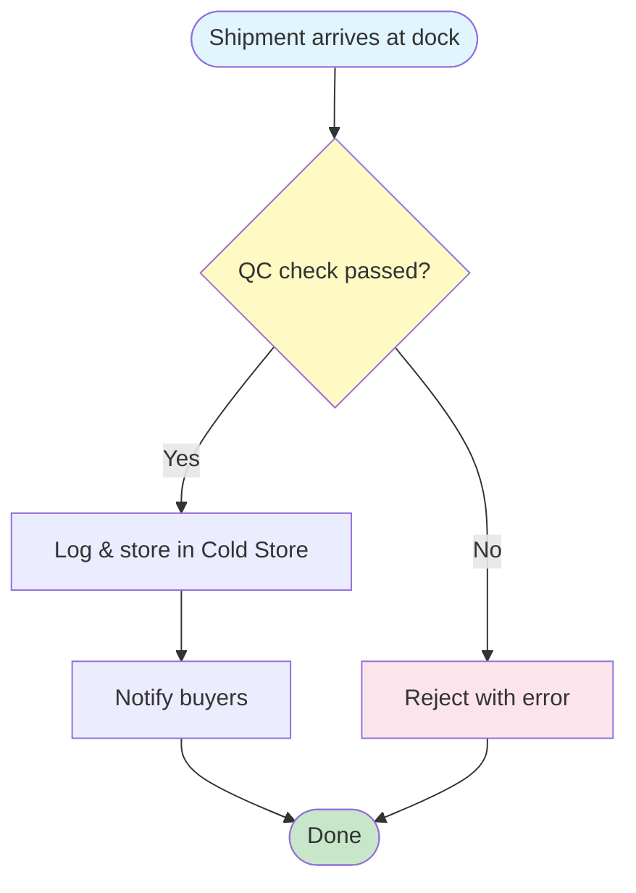
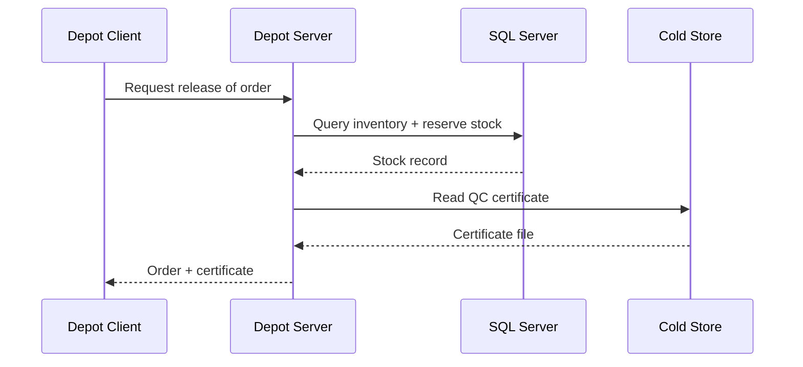
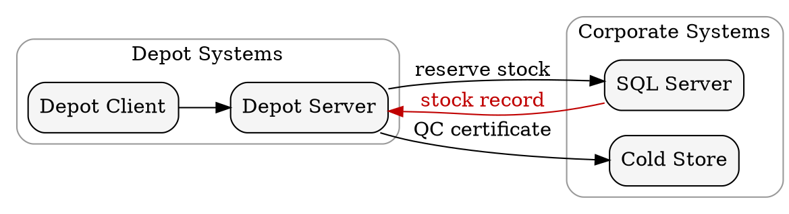
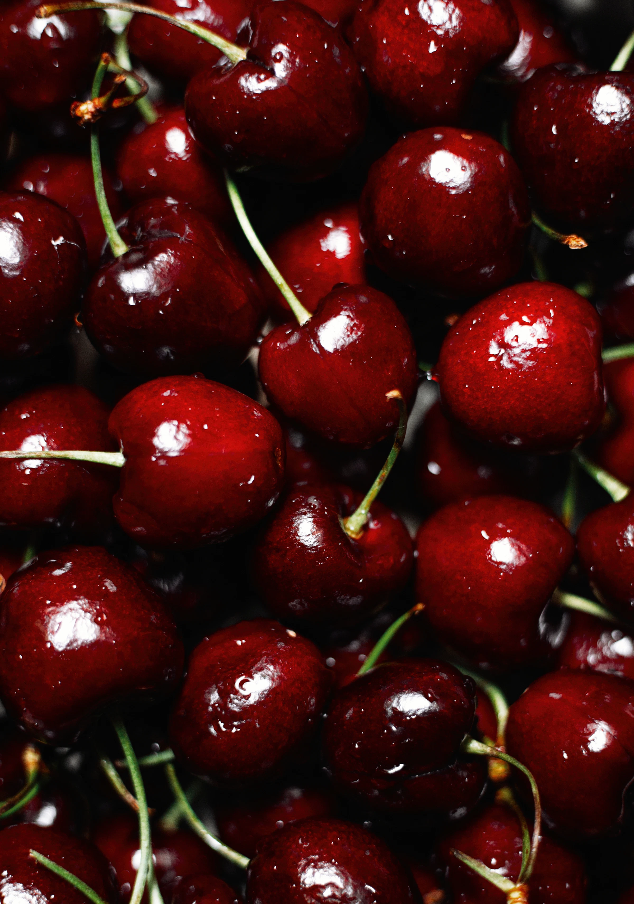

# ACME Corporation — Showcase Document

## Contents<!-- omit in toc -->

- [ACME Corporation — Showcase Document](#acme-corporation--showcase-document)
  - [Frontmatter \& Cover Page](#frontmatter--cover-page)
  - [Typography](#typography)
- [Heading 1](#heading-1)
  - [Heading 2](#heading-2)
    - [Heading 3](#heading-3)
      - [Heading 4](#heading-4)
        - [Heading 5](#heading-5)
          - [Heading 6](#heading-6)
  - [Lists](#lists)
  - [Tables](#tables)
  - [Code Blocks](#code-blocks)
  - [Mermaid Diagrams](#mermaid-diagrams)
    - [Intake flow](#intake-flow)
    - [Release sequence:](#release-sequence)
  - [Graphviz Diagrams](#graphviz-diagrams)
  - [Infographics](#infographics)
  - [Draw.io Diagrams](#drawio-diagrams)
  - [Math — KaTeX](#math--katex)
  - [Admonitions \& Alerts](#admonitions--alerts)
    - [GitHub Alerts](#github-alerts)
    - [MkDocs Admonitions](#mkdocs-admonitions)
  - [Blockquotes, Footnotes \& Abbreviations](#blockquotes-footnotes--abbreviations)
  - [Keyboard Shortcuts](#keyboard-shortcuts)
  - [Markdown Extras](#markdown-extras)
    - [Highlight, Subscript \& Superscript](#highlight-subscript--superscript)
    - [Definition Lists](#definition-lists)
    - [Code Line Highlighting](#code-line-highlighting)
    - [Captions](#captions)
    - [Columns](#columns)
    - [Collapsible Details](#collapsible-details)
    - [Spanning Table Cells](#spanning-table-cells)
    - [Including Source Files](#including-source-files)
  - [Document Controls](#document-controls)
    - [Numbered Headings](#numbered-headings)
    - [Running Header](#running-header)
    - [List of Tables \& Figures](#list-of-tables--figures)
    - [Watermark](#watermark)
    - [Code Line Numbers](#code-line-numbers)
    - [Trademark Symbols](#trademark-symbols)
    - [Classification](#classification)
    - [Frontmatter Variables](#frontmatter-variables)
    - [TOC Depth](#toc-depth)
    - [Paper Size \& Margins](#paper-size--margins)
    - [Page Orientation](#page-orientation)
    - [Cover \& Footer Overrides](#cover--footer-overrides)
    - [Cross-References with Page Numbers](#cross-references-with-page-numbers)
    - [Landscape Pages](#landscape-pages)
  - [Icons](#icons)
    - [Font Awesome](#font-awesome)
    - [Phosphor Icons](#phosphor-icons)
  - [Page Breaks \& Layout](#page-breaks--layout)
  - [Theme \& Branding](#theme--branding)
    - [Named Styles](#named-styles)
    - [Colour Palette](#colour-palette)
    - [Brand Logo](#brand-logo)
    - [Scheme Classes](#scheme-classes)
    - [Custom Style](#custom-style)
    - [Fonts](#fonts)

---

## Frontmatter & Cover Page {.page-break-before}

This guide is a fictional operations manual for **Orchard Depot** — a fruit-distribution warehouse's inventory and cold-storage system (Depot Server + SQL Server + Cold Store). It is rendered with the **`modern`** brand theme — a set of bright, fruit-named colour palettes, Urbanist typography, and product-family cover styles.

```yaml
---
# ── Document identity ─────────────────────────────────────────────
Title: ACME Corporation — Showcase Document
Document Info:                 # the cover's info block
    Author: ACME Corporation
    Date: "2026-04-08"
    Revision: 1
    Status: Final              # Work In Progress | Released — Released bumps the revision after export
Revisions Visible: 3           # rows shown on the cover; 0 hides the table
Revisions:
    - {Revision: 1, Date: "2026-04-08", Author: ACME Corporation, Remarks: Initial release}
Lang: en                       # <html lang>; default en

# ── Branding ──────────────────────────────────────────────────────
Theme: Modern                   # brand package — see --list-themes
Style: Cherry                   # or Blueberry, Lime, Guava, …
# Style:                       # …or an inline style instead of a named one:
#     Color: "#336699"         #   any hex, or a palette name
#     Image: path/or/url.jpg   #   hero photo behind a translucent gradient
#     Position: 30%            #   vertical crop offset
Logo: Guava                     # a name from the theme's `logos` map, or a path
Cover Logo:                    # a third-party logo overlaid on the cover
    - Path: assets/customer-logo.png
    - Background: rgba(255,255,255,0.5)

# ── Page setup ────────────────────────────────────────────────────
Header:                        # blank = use Title
Footer:                        # blank = "<page> of <total>"
Page Size: A4                  # A3 | A4 | A5 | Letter | Legal | Tabloid | "210mm 297mm"
Margins: 20mm                  # 1-4 CSS lengths, like the margin shorthand
TOC Depth: 3                   # deepest heading level listed; omit for all

# ── Document controls (all default to off) ────────────────────────
Numbered Headings: true        # 1, 1.1, 1.1.1 on h2-h6
Running Header: true           # header tracks the current section
List of Tables: true
List of Figures: true
Code Line Numbers: true
Trademark Symbols: true        # (c)/(r)/(tm) -> ©/®/™; off (default) keeps them literal
Watermark: Draft               # any text, or true to reuse Status
Classification: Internal       # Public | Internal | Confidential

# ── Content & output ──────────────────────────────────────────────
Variables:                     # {{Customer}} anywhere in the body
    Customer: ACME Corporation
Mode: pdf, html                # pdf | html | debug — comma-separated
---
```

**Title & subtitle.** On the cover the `Title` is split at the first *spaced* em-dash (`A — B`), en-dash, or colon (`A: B`). Here **ACME Corporation** is the headline and *Showcase Document* the subtitle. A title without a separator renders as a single headline.

**Every key is optional** and all of them are case-insensitive (`Page Size` and `page size` both work). Omit one and the export falls back to a sensible default.

**Document identity**

| Key                 | Description                                                                |
| ------------------- | -------------------------------------------------------------------------- |
| `Title`             | Split into headline + subtitle on the cover, as above                      |
| `Document Info`     | Cover info block — `Author`, `Date`, `Revision`, `Status`                  |
| `Revisions`         | List of `{Revision, Date, Author, Remarks}` entries for the revision table |
| `Revisions Visible` | How many revision rows the cover shows; `0` hides the table                |
| `Lang`              | Document language for the `<html lang>` attribute (default `en`)           |

`Revision` in the footer resolves in order: `Document Info.Revision`, then the last `Revisions` entry, then a top-level `Version` or `Revision`.

**Branding**

| Key          | Description                                                                                     |
| ------------ | ----------------------------------------------------------------------------------------------- |
| `Theme`      | Brand package — `Modern` here; see `--list-themes`                                              |
| `Style`      | Cover variant: a named style (`Cherry`, `Blueberry`, `Guava`, …), or `{Color, Image, Position}` |
| `Logo`       | Brand mark, chosen independently of `Style`                                                     |
| `Cover Logo` | Third-party logo overlaid on the cover — `Path` plus optional `Background`                      |

**Page setup**

| Key         | Description                                                                |
| ----------- | -------------------------------------------------------------------------- |
| `Header`    | Top-left running header; blank uses the `Title`                            |
| `Footer`    | Footer text; blank uses `<page> of <total>`                                |
| `Page Size` | `A3`, `A4`, `A5`, `Letter`, `Legal`, `Tabloid`, or a literal `210mm 297mm` |
| `Margins`   | 1-4 CSS lengths, like the CSS `margin` shorthand                           |
| `TOC Depth` | Deepest heading level listed in the TOC; omit for every level              |

**Document controls** — each covered in its own section further down

| Key                 | Description                                                    |
| ------------------- | -------------------------------------------------------------- |
| `Numbered Headings` | Auto-number `##`-`######` as 1, 1.1, 1.1.1                     |
| `Running Header`    | Header tracks the current section instead of a fixed string    |
| `List of Tables`    | Index of captioned tables after the TOC                        |
| `List of Figures`   | Index of captioned figures after the TOC                       |
| `Code Line Numbers` | Number every line of every fenced code block                   |
| `Trademark Symbols` | Converts `(c)`/`(r)`/`(tm)` to ©/®/™ — off by default          |
| `Watermark`         | Diagonal stamp; `true` reuses `Status`                         |
| `Classification`    | `Public`, `Internal` or `Confidential` in the top-right margin |

**Content & output**

| Key         | Description                                          |
| ----------- | ---------------------------------------------------- |
| `Variables` | Named values substituted into the body as `{{Name}}` |
| `Mode`      | `pdf`, `html`, `debug` — comma-separated for several |

> [!TIP]
> The frontmatter at the top of this document sets every one of these, so it doubles as a working reference — read it alongside the rendered result.

## Typography {.page-break-before}

# Heading 1
## Heading 2
### Heading 3
#### Heading 4
##### Heading 5
###### Heading 6

Normal paragraph text. **Bold text** stands out, while *italic text* adds emphasis. You can also combine them: ***bold and italic***.

Inline `code` suits paths like `D:\Depot\ColdStore` or commands like `iisreset`.

**Plain emphasis.** The markdown syntaxes stay plain, so a document reads the same here as it does anywhere else: `~~strikethrough~~` is an ordinary ~~struck line~~, and `++underline++` gives you the ++underline++ markdown.

**Revision marks.** The redline tint lives on the HTML tags, which you write deliberately: `<ins>inserted</ins>` and `<del>deleted</del>`, plus `==highlighted==`. Reaching for a tag is the opt-in — plain `~~tilde~~` never implies a tracked revision.

We <ins>added this clause</ins>, <del>removed that one</del>, and ==flagged this for review==. Compare plain ~~struck text~~ and ++underlined text++, which carry no revision colour.

Links look like this: [ACME Corporation](https://en.wikipedia.org/wiki/Acme_Corporation). They are clickable in the PDF.

Emoji are supported too 🛠️ — from classics like ✅ 🗄️ ⚠️ to recent additions: pink heart 🩷 and jellyfish 🪼.

Horizontal rules separate sections:

---

## Lists

**Server roles** (unordered):

- Depot Server (Orchard Depot Server — ODS)
- SQL Server
  - Inventory database
  - `tempdb` on fast storage
- Cold Store (binary storage for QC photos & certificates)

**Deployment order** (ordered):

1. Provision the server
2. Install prerequisites
   1. IIS
   2. SQL Server
3. Install the Depot Server and create the depotƒ

**Mixed:**

- Storage
  1. OS on SSD
  2. Cold Store on NVMe
- Backup
  1. database
  2. cold store

---

## Tables

Tables are rendered with the branded Modern style. Columns can be left-, center-, or right-aligned.

| Component        | Supported versions        | Notes                            |
| ---------------- | ------------------------- | -------------------------------- |
| **Server OS**    | Windows Server 2019, 2022 | Standard or Datacenter           |
| **SQL Server**   | 2019, 2022                | Express, Standard, or Enterprise |
| **Depot Server** | 2024, 2025, 2026, 2027    | Professional or Workgroup        |

**Column alignment:**

| Left-aligned   | Center-aligned | Right-aligned |
| :------------- | :------------: | ------------: |
| Text           |      Text      |          Text |
| Longer content |    Centered    |         1,234 |
| Short          |      Mid       |        99,999 |

---

## Code Blocks {.page-break-before}

Fenced code blocks use `highlight.js` for syntax highlighting.

**PowerShell — archive stale files:**

```powershell
$coldStorePath = "D:\Depot\ColdStore"
$backupPath    = "D:\Depot\Backup"

Get-ChildItem $coldStorePath -Recurse |
    Where-Object { $_.LastWriteTime -lt (Get-Date).AddDays(-30) } |
    Copy-Item -Destination $backupPath
```

**SQL — cap SQL Server memory:**

```sql
USE master;
EXEC sp_configure 'show advanced options', 1;
RECONFIGURE;
EXEC sp_configure 'max server memory (MB)', 10240;
RECONFIGURE WITH OVERRIDE;
```

**JSON — a connection descriptor:**

```json
{
  "server": { "host": "10.10.101.105", "instance": "ORCHARDDEPOT", "port": 1433 },
  "backup": { "location": "D:\\Depot\\Backup", "schedule": "0 20 * * 1-5" }
}
```

---

## Mermaid Diagrams {.page-break-before}

Mermaid diagrams are rendered to SVG and embedded directly in the PDF.

### Intake flow



### Release sequence:



## Graphviz Diagrams {.page-break-before}

` ```dot ` (or ` ```graphviz `) fences are laid out to SVG by a WASM build of Graphviz — no browser, no network, no external binary. Graphviz's clustering is a natural fit for a system map like this, where Mermaid's flowchart syntax has no equivalent to a bounded subgraph:



## Infographics {.page-break-before}

` ```infographic ` fences render [AntV Infographic](https://github.com/antvis/infographic)'s declarative syntax — lists, sequences, hierarchies, comparisons and charts — with no browser. Icons are [Iconify](https://icon-sets.iconify.design/) names; only those names are sent, and `--infographic-icons none` sends nothing at all. Many templates give text a fixed slot, so keep labels short. An extensive AntV Infographic library can be found at here: [Infographic Gallery](https://infographic.antv.vision/gallery)

```infographic
infographic sequence-mountain-underline-text
data
  title Fresh Fruit, Delivered Right
  desc From arrival at the dock to release for delivery
  sequences
    - label Dock Arrival
      value 85
      desc Fresh shipments received directly from growers and suppliers
      time Step 1
      icon mdi/truck-delivery-outline
      illus logistics
    - label Quality Control
      value 90
      desc Every shipment inspected for quality and condition
      time Step 2
      icon mdi/clipboard-check-outline
      illus quality-check
    - label Cold Storage
      value 95
      desc Fruit stored under controlled conditions to preserve freshness
      time Step 3
      icon mdi/snowflake
      illus cold-storage
    - label Order Picking
      value 88
      desc Orders carefully selected and prepared for each customer
      time Step 4
      icon mdi/package-variant
      illus warehouse
    - label Release
      value 92
      desc Orders released with the required certificates and documentation
      time Step 5
      icon mdi/file-certificate-outline
      illus documents
    - label Delivery
      value 90
      desc Fresh produce dispatched quickly to customers and markets
      time Step 6
      icon mdi/truck-fast-outline
      illus delivery
theme light
  palette #e76f51 #f4a261 #e9c46a #2a9d8f #264653
```

Figure: The depot's six stations

```infographic
infographic sequence-zigzag-steps-underline-text
data
  title Fresh Fruit, Delivered Right
  desc From arrival at the dock to release for delivery
  sequences
    - label Dock Arrival
      value 85
      desc Fresh shipments received directly from growers and suppliers
      time Step 1
      icon mdi/truck-delivery-outline
      illus logistics
    - label Quality Control
      value 90
      desc Every shipment inspected for quality and condition
      time Step 2
      icon mdi/clipboard-check-outline
      illus quality-check
    - label Cold Storage
      value 95
      desc Fruit stored under controlled conditions to preserve freshness
      time Step 3
      icon mdi/snowflake
      illus cold-storage
    - label Order Picking
      value 88
      desc Orders carefully selected and prepared for each customer
      time Step 4
      icon mdi/package-variant
      illus warehouse
    - label Release
      value 92
      desc Orders released with the required certificates and documentation
      time Step 5
      icon mdi/file-certificate-outline
      illus documents
    - label Delivery
      value 90
      desc Fresh produce dispatched quickly to customers and markets
      time Step 6
      icon mdi/truck-fast-outline
      illus delivery
theme hand-drawn
  palette spectral
```

Figure: The same Infographic, but with a different template and a hand-drawn style and a spectral palette

::: landscape

## Draw.io Diagrams {.page-break-before}


:::

## Math — KaTeX {.page-break-before}

Mathematical expressions are rendered by KaTeX — inline and as display blocks.

**Optimal cold-store capacity** (inline): $C_{opt} = S + B + P$, where $S$ is current stock volume, $B$ the buffer reserve, and $P$ the peak seasonal intake — all in pallets.

**Display block — usable crate slots after reserving space for buffer and peak intake:**

$$
C_{max} = \bigl(C_{ins} - (B + P)\bigr) \times 24 \quad \text{(crates)}
$$

**Example:** if $S = 540\,\text{pallets}$, $B = 40\,\text{pallets}$, $P = 20\,\text{pallets}$:

$$
C_{opt} = 540 + 40 + 20 = \mathbf{600\ pallets}
$$

---

## Admonitions & Alerts {.page-break-before}

Two syntaxes are supported: **GitHub Alerts** and **MkDocs-style admonitions**.

### GitHub Alerts

> [!NOTE]
> Keep frequently-ordered SKUs on the pick-face shelves closest to dispatch.

> [!TIP]
> Store the inventory database and Cold Store on separate fast volumes.

> [!IMPORTANT]
> Cold Store humidity must stay below 90% RH — condensation ruins soft fruit within hours.

> [!WARNING]
> Never clear a pallet from Cold Store without a verified, restorable backup of its QC record.

> [!CAUTION]
> Overselling reserved stock during a flash promotion will starve same-day dispatch.

### MkDocs Admonitions

!!! note
    Default note admonition — no custom title.

!!! tip Pro tip
    Schedule stock counts outside receiving hours to avoid dock contention.

!!! warning Check your ripeness window
    Bananas and avocados ripen fastest — always apply first-in, first-out rotation.

!!! danger Data loss risk
    Clearing a pallet from Cold Store without a verified backup is irreversible.

!!! success
    All checks passed. The depot is ready for the morning dispatch run.

---

## Blockquotes, Footnotes & Abbreviations

**Blockquote:**

> The single biggest win for dispatch accuracy is keeping the entire stock ledger in sync with the loading dock in real time.
>
> — Orchard Depot Operations Handbook

**Footnotes:**

Cold Store humidity sensors must stay calibrated to within 2% RH.[^calib] The Depot Server's Express tier is limited to 10 GB of ledger data.[^express]

[^calib]: Orchard Depot 2026 Administration Guide, Chapter 3.
[^express]: Microsoft SQL Server 2022 Editions and Features comparison.

**Abbreviations:**

*[ODS]: Orchard Depot Server
*[IIS]: Internet Information Services
*[NVMe]: Non-Volatile Memory Express
*[SQL]: Structured Query Language

For example: ODS runs on top of IIS and uses SQL for metadata; the Cold Store is best hosted on NVMe.

---

## Keyboard Shortcuts

Use the `<kbd>` tag to render a keyboard key or chorded shortcut:

```markdown
<kbd>Ctrl</kbd> + <kbd>Alt</kbd> + <kbd>Space</kbd>
```

Press <kbd>Ctrl</kbd> + <kbd>Alt</kbd> + <kbd>Space</kbd> to open the launcher. Single keys work the same way: <kbd>Esc</kbd>, <kbd>Enter</kbd>, <kbd>⌘</kbd>, <kbd>⇧</kbd>.

---

## Markdown Extras {.page-break-before}

### Highlight, Subscript & Superscript

Mark important text with `==highlight==`: this phrase is ==highlighted== for emphasis.

Chemical formulas use subscript (`H~2~O`): water is H~2~O and carbon dioxide is CO~2~.

Exponents use superscript (`x^2^`): the area of a circle is πr^2^, and 2^10^ = 1024.

### Definition Lists

```markdown
Term
: Definition of the term, indented below it.
```

Markdown
: A lightweight markup language for formatting plain text.

WeasyPrint
: The HTML-to-PDF rendering engine used for the PDF output mode.

### Code Line Highlighting

Add a `:2,4-6`-style line range after the language to highlight specific lines — no space, no braces (braces there would collide with `markdown-it-attrs`' own `{.class}` syntax on fences):

````markdown
```typescript:2,4-5
function greet(name: string): string {
    const greeting = `Hello, ${name}!`;
    console.log(greeting);
    return greeting;
    // highlighted through here
}
```
````

```typescript:2,4-5
function greet(name: string): string {
    const greeting = `Hello, ${name}!`;
    console.log(greeting);
    return greeting;
    // highlighted through here
}
```

### Captions

Add a `Table: caption` or `Figure: caption` paragraph directly under a table or image for an auto-numbered caption. Tables and figures are numbered independently:

| A   | B   |
| --- | --- |
| 1   | 2   |

Table: Two-column example with an auto-numbered caption.

Figures work the same way — the counters are independent, so this is Figure 1 even though Table 1 came first:

{style="width:150px"}

Figure: A standalone image with an auto-numbered caption that has a width of 150px.

### Columns

Lay content out side by side with nested containers. The outer wrapper needs **more** colons than the inner blocks (`::::` outside, `:::` inside) — with equal-length fences the parser can't tell which `:::` closes which block:

```markdown
:::: columns
::: column
Left column content.
:::
::: column
Right column content.
:::
::::
```

:::: columns
::: column
**Left column.** Good for a summary, a quote, or a short list.
:::
::: column
**Right column.** Good for the counterpart — a comparison, a caveat, or supporting detail.
:::
::::

### Collapsible Details

`<details>` / `<summary>` renders as a styled block. In the **PDF** it always shows its content — there's no click to expand on paper. In the **HTML export**, opened in a real browser, it's genuinely collapsible.

<details>
<summary>Click to expand (in HTML — always open in PDF)</summary>

Hidden detail content goes here. Useful for optional context that shouldn't compete with the main flow.

</details>

---

### Spanning Table Cells {.page-break-before}

Merge cells with `{colspan=N}` / `{rowspan=N}` on the cell. The rule is the same in both directions: **the covered cells are simply not written**, so a spanning row has fewer `|` cells than the header.

```markdown
| Region         | Site      | Role    |
| -------------- | --------- | ------- |
| EU {rowspan=2} | Venlo     | Primary |
| Genk           | Secondary |
| APAC           | Osaka     | Primary |
```

| Region         | Site      | Role    |
| -------------- | --------- | ------- |
| EU {rowspan=2} | Venlo     | Primary |
| Genk           | Secondary |
| APAC           | Osaka     | Primary |

Table: `{rowspan=2}` — the covered row writes one fewer cell.

```markdown
| Phase                               | Task         | Owner |
| ----------------------------------- | ------------ | ----- |
| Design                              | Draft schema | WB    |
| Spans first two columns {colspan=2} | PS           |
```

| Phase                               | Task         | Owner |
| ----------------------------------- | ------------ | ----- |
| Design                              | Draft schema | WB    |
| Spans first two columns {colspan=2} | PS           |

Table: `{colspan=2}` — that row writes one fewer cell too.

### Including Source Files

`[!include](file.md)` splices another markdown document. Two extensions to it:

- **Any non-markdown file** is quoted as a fenced code block, with the language inferred from its extension — so documentation can quote live source instead of a copy that silently rots.
- **A `#L` fragment** takes only those lines: `#L10` for one line, `#L10-L25` for a range. Works on markdown includes too, where it splices the excerpt inline (no page break, no revision heading) rather than as a whole document.

```markdown
[!include](../src/types.ts)           <!-- whole file, as TypeScript -->
[!include](../src/types.ts#L3-L9)     <!-- just those lines -->
[!include](chapter.md#L1-L20)         <!-- a markdown excerpt, spliced inline -->
[!include](Main.config "xml")         <!-- override the language -->
```

A **link title overrides the language**, for extensions that say nothing about their content — a `.config` file is usually XML, not a language called "config". It combines with a range (`Main.config#L5-L40 "xml"`), and because a language only means anything for a code block, giving one also *forces* code-block treatment: `[!include](chapter.md "markdown")` quotes the markdown source instead of splicing it in.

Lines 3-9 of this project's `src/types.ts`, pulled in live at export time:

[!include](../../src/types.ts#L3-L9)

---

## Document Controls {.page-break-before}

These are switched on per document from the YAML frontmatter — **this sample enables all of them**, so every effect described below is visible in this very PDF:

```yaml
Numbered Headings: true      # 1, 1.1, 1.1.1 on every heading
Running Header: true         # top-left header tracks the current section
List of Tables: true         # index of captioned tables, after the TOC
List of Figures: true        # index of captioned figures, after the TOC
Code Line Numbers: true      # number every line of every code block
Trademark Symbols: true      # (c)/(r)/(tm) -> ©/®/™
Watermark: Sample            # diagonal stamp; `true` reuses Document Info → Status
Classification: Internal     # Public | Internal | Confidential
```

### Numbered Headings

`Numbered Headings: true` prefixes every `##`-`######` with a hierarchical number: `##` is section 1, `###` is 1.1, `####` is 1.1.1. `#` is never numbered — it is the document title, not a section.

The numbering is applied before the table of contents is rebuilt, so **the TOC always shows the same numbers as the body** — they cannot drift apart.

### Running Header

`Running Header: true` replaces the static `Header:` string in the top-left margin with the title of the section currently being read. Flip back to this page's header and you will see it reads *Document Controls*, not the document title.

### List of Tables & Figures

`List of Tables: true` and `List of Figures: true` each emit an index directly after the table of contents, built from the auto-numbered captions described under [Captions](#captions){.page-ref} — with live page numbers, like the TOC. An enabled list with no captions of that kind emits nothing rather than an empty heading.

### Watermark

`Watermark: Sample` stamps a faint diagonal label across every page — the word you are reading behind this text. Setting `Watermark: true` instead reuses the document's `Status` field, which is the usual way to mark a *Work in Progress* draft.

### Code Line Numbers

`Code Line Numbers: true` numbers every line of every fenced code block, which pairs naturally with the line highlighting from [Code Line Highlighting](#code-line-highlighting){.page-ref} — you can then write "see line 4" and have it mean something:

```typescript:3
interface ExportOptions {
    theme: string;
    mode: ("pdf" | "html")[];   // line 3 — highlighted and numbered
}
```

### Trademark Symbols

`Trademark Symbols: true` converts `(c)`, `(r)`, `(tm)` to ©, ®, ™. It defaults to **off**, because those sequences show up far more often as literal parentheticals — a revision marker written `(R)`, an option labelled `(c)` — than as an actual trademark reference, and silently swapping one for a symbol would corrupt real text. This document opts in, so here they convert: (c) (r) (tm).

### Classification

`Classification:` prints a sensitivity label in the **top-right** margin of every page:

| Value          | Result                                      |
| -------------- | ------------------------------------------- |
| `Public`       | a green shield followed by *Public*         |
| `Internal`     | an amber shield followed by *Internal*      |
| `Confidential` | an orange shield followed by *Confidential* |

Table: The three Classification values and what each prints.

This document is set to `Public`, so a green shield sits in the top-right corner of every page. The shield is Phosphor's duotone weight: the fill takes the classification colour, the outline is black.

### Frontmatter Variables

Define a `Variables:` mapping and reference it as `{{Name}}` anywhere in the body — the substitution happens before parsing, so a value can be a word, a URL, or a whole sentence. One template, many customers:

```yaml
Variables:
    Customer: ACME Manufacturing
    Contact: J. de Vries
```

> This document was prepared for **{{Customer}}**, contact {{Contact}}.

An undefined placeholder is left exactly as written and logged as a warning — blanking it silently would let a typo ship as an invisible hole in a customer deliverable.

### TOC Depth

`TOC Depth: 3` limits the table of contents to `###` and shallower. Deeper headings still render — and still get numbered — they just stop cluttering the contents page. This document uses depth 3, which is why the `####` heading under [Typography](#typography){.page-ref} is absent from the TOC but present in the body.

### Paper Size & Margins

```yaml
Page Size: A4        # A3 | A4 | A5 | Letter | Legal | Tabloid, or "210mm 297mm"
Margins: 20mm        # 1-4 CSS lengths, like the CSS margin shorthand
```

`Margins` accepts the same 1-4 value shorthand as CSS (`20mm`, `25mm 15mm`, `25mm 15mm 20mm 15mm`). Both also drive the height cap applied to diagrams, so a tall Mermaid chart is scaled to fit the sheet it lands on instead of running off the bottom — which matters most on a `::: landscape` page, where a rotated A4 is only 210mm tall.

### Page Orientation

`Orientation: landscape` turns the **whole** document landscape — body pages and cover alike. It defaults to `portrait`, which is what this sample uses.

```yaml
Orientation: landscape
```

Either way, two containers force a single sheet of the opposite orientation, so the document default is only ever a default:

```markdown
::: landscape        <!-- one landscape sheet, in a portrait document -->
| a wide table … |
:::

::: portrait         <!-- one portrait sheet, in a landscape document -->
Ordinary prose that reads better upright.
:::
```

They are symmetric — `::: portrait` is simply the mirror of the `::: landscape` shown under [Landscape Pages](#landscape-pages){.page-ref}, and each is a harmless no-op when it matches the document default.

### Cover & Footer Overrides

The generated cover and the page-margin logo can be tuned per document, without editing the theme. Every one of these keys also accepts `false` to remove that element outright:

```yaml
Cover Page: false                    # no cover at all — but Style's colours stay
Cover Slogan: Engineering, delivered.
Cover Address:                       # a list becomes one line per entry
    - ACME Manufacturing B.V.
    - Industrieweg 12
Cover Footer Logo: Lime               # the cover's bottom-right brand mark
Footer Logo: Lime                     # the bottom-centre mark on every page
```

| Key                 | Controls                                           | `false`       |
| ------------------- | -------------------------------------------------- | ------------- |
| `Cover Page`        | whether a cover is generated at all                | no cover page |
| `Cover Slogan`      | the slogan line, bottom-left of the cover          | line removed  |
| `Cover Address`     | the address block, right of the cover's info table | block removed |
| `Cover Footer Logo` | the brand mark, bottom-right of the cover          | mark removed  |
| `Footer Logo`       | the brand mark in the bottom-centre page margin    | mark removed  |

Table: The cover and footer override keys.

`Cover Page: false` is worth calling out: omitting `Style` also removes the cover, but takes the brand colours with it — headings and table headers fall back to the theme default. This key removes only the page.

Logo values resolve the same way as [Brand Logo](#brand-logo){.page-ref} — a name from the theme's `logos` map, or a path — so a typo exits with code 3 instead of quietly reverting to the house mark.

### Cross-References with Page Numbers

Add `{.page-ref}` to any internal link and the resolved page number is appended when the PDF is laid out:

```markdown
See [the Captions section](#captions){.page-ref} for details.
```

See [the Captions section](#captions){.page-ref} for details — the page number in that sentence was computed at export time, not typed.

### Landscape Pages

Wrap wide content in a `::: landscape` container to give it its own rotated sheet, instead of squeezing it into the portrait text column:

```markdown
::: landscape
| a wide table … |
:::
```

The table below sits on its own landscape page:

::: landscape

| WBS     | Task                        | Form | Hours | Role            | Location | Milestone |
| ------- | --------------------------- | ---- | ----- | --------------- | -------- | :-------: |
| 1.1.1.1 | Review requirements         | TM   | 2     | Consultant      |          |           |
| 1.1.2.1 | Project brief               | NA   | 0     | Account Manager | Customer |     Y     |
| 1.2.1.1 | Project management          | TM   | 4     | Project Manager |          |           |
| 1.2.3.1 | Scoping workshop @ customer | FP   | 8     | PM, Consultant  | Customer |     Y     |

Table: A seven-column table given its own landscape sheet.

:::

---

## Icons {.page-break-before}

Two icon libraries are bundled automatically when their tags appear.

### Font Awesome

| Style    | HTML                                                          | Result                                                          |
| -------- | ------------------------------------------------------------- | --------------------------------------------------------------- |
| Solid    | `<i class="fa-solid fa-server">`                              | <i class="fa-solid fa-server"></i>                              |
| Regular  | `<i class="fa-regular fa-hard-drive">`                        | <i class="fa-regular fa-hard-drive"></i>                        |
| Coloured | `<i class="fa-solid fa-circle-check" style="color:#22863a;">` | <i class="fa-solid fa-circle-check" style="color:#22863a;"></i> |

### Phosphor Icons

<i class="ph ph-database"></i> regular &nbsp; <i class="ph-bold ph-cloud-arrow-up"></i> bold &nbsp; <i class="ph-fill ph-check-circle" style="color:#22863a;"></i> fill

---

## Page Breaks & Layout

Add `{.page-break-before}` after a heading to start it on a new page:

```markdown
## My Section {.page-break-before}
```

The attribute is stripped from the TOC link and anchor. Use `<!-- omit in toc -->` after a heading to keep it out of the Table of Contents.

---

## Theme & Branding {.page-break-before}

A **theme** is a swappable brand package under `themes/`. The **`modern`** theme is a generic, brand-neutral package — a set of bright, fruit-named colour palettes, Urbanist typography, and a family of product cover styles.

```yaml
Theme: Modern
Style: Cherry
```

### Named Styles

Modern ships one cover style per colour palette, each with its own dedicated hero photo to drive the cover gradient and tint headings and table headers:

| Style name     | Palette        | Primary colour | Hero photo                         |
| -------------- | -------------- | -------------- | ---------------------------------- |
| `none`         | `Cherry`       | `#f50029`      | *(no hero — flat colour)*          |
| `Cherry`       | `Cherry`       | `#f50029`      | cherries                           |
| `Blueberry`    | `Blueberry`    | `#004cff`      | blueberries                        |
| `Lime`         | `Lime`         | `#00cc44`      | sliced lime                        |
| `Lemon`        | `Lemon`        | `#ffd500`      | lemons                             |
| `Tangerine`    | `Tangerine`    | `#ff7700`      | tangerines                         |
| `Plum`         | `Plum`         | `#7312e2`      | plums                              |
| `Guava`        | `Guava`        | `#ff2982`      | guava                              |
| `Dragonfruit`  | `Dragonfruit`  | `#e600a1`      | dragon fruit                       |
| `Cyan`         | `Cyan`         | `#00b2d6`      | fruit plate                        |
| `Kiwi`         | `Kiwi`         | `#00ada8`      | kiwi                               |
| `Starfruit`    | `Starfruit`    | `#0bd5a3`      | starfruit                          |
| `Papaya`       | `Papaya`       | `#ff5e3d`      | papaya                             |
| `Blackcurrant` | `Blackcurrant` | `#1700eb`      | blackcurrants                      |
| `Gooseberry`   | `Gooseberry`   | `#7de506`      | gooseberries                       |
| `Grey`         | `Grey`         | `#7b8993`      | fruit plate (same photo as `Cyan`) |

Every style except `none` carries its own Unsplash photo under `hero/modern-hero-<fruit>.webp`, with the photographer credited in `theme.json`'s `attribution` field for that style.

### Colour Palette

Each palette is a seven-stop ramp — `extraLight` → `light` → `main` → `regular` → `medium` → `dark` → `extraDark` — defined once in `theme.json` and emitted as CSS variables named `--<colour>-<stop>`:

```css
var(--cherry-main)         /* #f0425f */
var(--kiwi-dark)           /* #006663 */
var(--blackcurrant-extra-light)
```

Every palette also gets a gradient token, `--gradient-<colour>` (135°, `light` → `dark`):

```css
background: var(--gradient-plum);
```

The fifteen palettes are custom-built for this theme — eleven bright, high-impact hues (red, blue, green, yellow, orange, purple, pink, magenta, cyan, teal, turquoise), three bonus colours (coral, indigo, chartreuse), and a cool "toner grey" — each named after a fruit rather than a product or brand. See `theme.json`'s `// fruitNames` comment for the full colour → fruit mapping.

> [!NOTE]
> Every ramp's `main` stop is a paler tint of the colour — `Kiwi`'s is `#12d9d2`. A printed page wants something stronger, so headings, table headers and the cover gradient draw from the stop named in `theme.json`'s `paletteRoles` (every palette's `medium` stop, e.g. Kiwi's `#00ada8`, except Grey's `extraDark`) rather than from `main`. The variables themselves are untouched: `var(--kiwi-main)` still gives you the pale tint.

### Brand Logo

`Logo:` picks the brand mark **independently of `Style:`** — so a document can carry a different fruit's icon over a completely different cover style:

```yaml
Style: Cherry        # Cherry-red cover
Logo: Guava          # …with the Guava icon mark
```

The value is either a fruit name from the theme's `logos` map — `Blackcurrant`, `Blueberry`, `Cherry`, `Dragonfruit`, `Gooseberry`, `Guava`, `Kiwi`, `Lemon`, `Lime`, `Papaya`, `Plum`, `Starfruit`, `Tangerine` — or a path to your own image. Names are matched case-insensitively. Omit the key to keep the theme's house logo (Acme).

An unrecognised name is a hard error rather than a silent fallback: a wrong brand mark on a client deliverable shouldn't ship quietly. That includes `Cyan` and `Grey` — neither is a fruit, so neither has an icon, and naming one as a `Logo:` fails the export rather than quietly falling back.

> [!NOTE]
> `Logo` and `Cover Logo` are different things. `Logo` is the fruit-icon mark (or the house Acme mark) in the cover footer and page header; `Cover Logo` overlays a *third-party* logo (a customer or partner) on the cover.

### Scheme Classes

Drop a `modern-<colour>-scheme` (heavy) or `modern-<colour>-light-scheme` (content-first) class on any raw HTML block for an inline swatch. One pair is generated per palette:

```html
<div class="modern-cyan-scheme">Cyan — heavy scheme</div>
<div class="modern-cyan-light-scheme">Cyan — light scheme</div>
```

The heavy variant fills with the palette's `main` stop, the light variant with `extraLight`. Text colour is picked automatically for WCAG AA contrast, so a pale `main` never yields unreadable white-on-light.

| Palette        | Heavy class                  | Light class                        | Heavy fill | Light fill |
| -------------- | ---------------------------- | ---------------------------------- | ---------- | ---------- |
| `Cherry`       | `modern-cherry-scheme`       | `modern-cherry-light-scheme`       | `#f0425f`  | `#f0dbde`  |
| `Blueberry`    | `modern-blueberry-scheme`    | `modern-blueberry-light-scheme`    | `#4c7df0`  | `#e2e7f3`  |
| `Lime`         | `modern-lime-scheme`         | `modern-lime-light-scheme`         | `#1ded62`  | `#bee4cb`  |
| `Lemon`        | `modern-lemon-scheme`        | `modern-lemon-light-scheme`        | `#f0d54c`  | `#f3f0e2`  |
| `Tangerine`    | `modern-tangerine-scheme`    | `modern-tangerine-light-scheme`    | `#f0994c`  | `#f3eae2`  |
| `Plum`         | `modern-plum-scheme`         | `modern-plum-light-scheme`         | `#9342f0`  | `#e5dbf0`  |
| `Guava`        | `modern-guava-scheme`        | `modern-guava-light-scheme`        | `#f471a8`  | `#f8edf1`  |
| `Dragonfruit`  | `modern-dragonfruit-scheme`  | `modern-dragonfruit-light-scheme`  | `#ef34b7`  | `#ecd0e3`  |
| `Cyan`         | `modern-cyan-scheme`         | `modern-cyan-light-scheme`         | `#26cced`  | `#c5e2e7`  |
| `Kiwi`         | `modern-kiwi-scheme`         | `modern-kiwi-light-scheme`         | `#12d9d2`  | `#a8dcda`  |
| `Starfruit`    | `modern-starfruit-scheme`    | `modern-starfruit-light-scheme`    | `#2feebe`  | `#cceae3`  |
| `Papaya`       | `modern-papaya-scheme`       | `modern-papaya-light-scheme`       | `#f59784`  | `#f8efed`  |
| `Blackcurrant` | `modern-blackcurrant-scheme` | `modern-blackcurrant-light-scheme` | `#4b39ef`  | `#d6d4ed`  |
| `Gooseberry`   | `modern-gooseberry-scheme`   | `modern-gooseberry-light-scheme`   | `#9aef39`  | `#e1edd4`  |
| `Grey`         | `modern-grey-scheme`         | `modern-grey-light-scheme`         | `#4e585f`  | `#f1f2f4`  |

Red=Cherry, Blue=Blueberry, Green=Lime, Yellow=Lemon, Orange=Tangerine, Purple=Plum, Pink=Guava, Magenta=Dragonfruit, Teal=Kiwi, Turquoise=Starfruit, Indigo=Blackcurrant, Chartreuse=Gooseberry — plus Cyan, Papaya (coral) and Grey, which keep their plain names.

All 30 schemes, heavy on the left and light on the right:

:::: columns
::: column
<div class="modern-cherry-scheme">Cherry</div>
<div class="modern-blueberry-scheme">Blueberry</div>
<div class="modern-lime-scheme">Lime</div>
<div class="modern-lemon-scheme">Lemon</div>
<div class="modern-tangerine-scheme">Tangerine</div>
<div class="modern-plum-scheme">Plum</div>
<div class="modern-guava-scheme">Guava</div>
<div class="modern-dragonfruit-scheme">Dragonfruit</div>
<div class="modern-cyan-scheme">Cyan</div>
<div class="modern-kiwi-scheme">Kiwi</div>
<div class="modern-starfruit-scheme">Starfruit</div>
<div class="modern-papaya-scheme">Papaya</div>
<div class="modern-blackcurrant-scheme">Blackcurrant</div>
<div class="modern-gooseberry-scheme">Gooseberry</div>
<div class="modern-grey-scheme">Grey</div>
:::
::: column
<div class="modern-cherry-light-scheme">Cherry</div>
<div class="modern-blueberry-light-scheme">Blueberry</div>
<div class="modern-lime-light-scheme">Lime</div>
<div class="modern-lemon-light-scheme">Lemon</div>
<div class="modern-tangerine-light-scheme">Tangerine</div>
<div class="modern-plum-light-scheme">Plum</div>
<div class="modern-guava-light-scheme">Guava</div>
<div class="modern-dragonfruit-light-scheme">Dragonfruit</div>
<div class="modern-cyan-light-scheme">Cyan</div>
<div class="modern-kiwi-light-scheme">Kiwi</div>
<div class="modern-starfruit-light-scheme">Starfruit</div>
<div class="modern-papaya-light-scheme">Papaya</div>
<div class="modern-blackcurrant-light-scheme">Blackcurrant</div>
<div class="modern-gooseberry-light-scheme">Gooseberry</div>
<div class="modern-grey-light-scheme">Grey</div>
:::
::::

### Custom Style

Instead of a named style, provide a `Color` and an optional hero `Image`:

```yaml
Style:
    Color: "#2a9d8f"
    Image: https://example.com/hero.jpg
```

**Overlay.** The gradient washing over `Image` is the resolved colour at two opacities — the gradient's top (0%) and bottom (90%) stops. Without an `Overlay`, that's a flat 80% with a photo, fully opaque without one. Set `Overlay: [start, end]` to pick your own range instead:

```yaml
Style:
    Color: Cherry
    Image: https://example.com/hero.jpg
    Overlay: [0.3, 0.9]     # lighter at the top, nearly solid at the bottom
```

Both stops use the *same* colour, so this is a soft opacity fade top-to-bottom, not a blend between two different hues. It works the same way with a named style plus your own photo (`Style: { Name: Cherry, Image: ..., Overlay: [...] }`).

### Fonts

The **Modern** theme sets its heading typography to Urbanist, loaded from Google Fonts (`css/fonts.css`) for the HTML export; the PDF falls back to the system sans-serif stack since no font is embedded:

`Urbanist, sans-serif`
