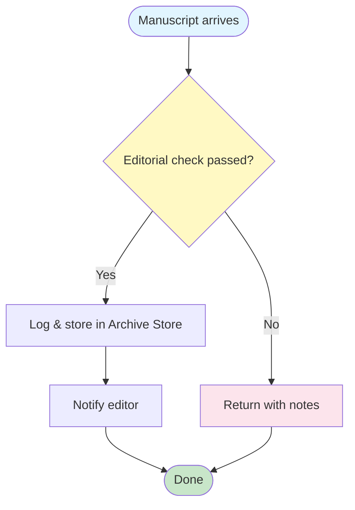
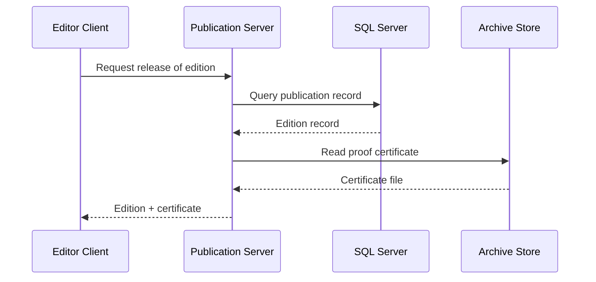
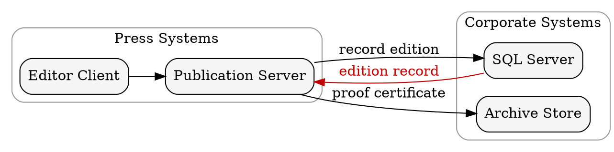

# Platen Markdown Export: A Feature Showcase

## Contents<!-- omit in toc -->

- [Platen Markdown Export: A Feature Showcase](#platen-markdown-export-a-feature-showcase)
  - [Frontmatter \& Cover Page](#frontmatter--cover-page)
  - [Typography](#typography)
- [Heading 1](#heading-1)
  - [Heading 2](#heading-2)
    - [Heading 3](#heading-3)
      - [Heading 4](#heading-4)
        - [Heading 5](#heading-5)
          - [Heading 6](#heading-6)
  - [Lists](#lists)
  - [Tables](#tables)
  - [Code Blocks](#code-blocks)
  - [Mermaid Diagrams](#mermaid-diagrams)
    - [Intake flow](#intake-flow)
    - [Release sequence:](#release-sequence)
  - [Graphviz Diagrams](#graphviz-diagrams)
  - [Infographics](#infographics)
  - [Draw.io Diagrams](#drawio-diagrams)
  - [Math — KaTeX](#math--katex)
  - [Admonitions \& Alerts](#admonitions--alerts)
    - [GitHub Alerts](#github-alerts)
    - [MkDocs Admonitions](#mkdocs-admonitions)
  - [Blockquotes, Footnotes \& Abbreviations](#blockquotes-footnotes--abbreviations)
  - [Keyboard Shortcuts](#keyboard-shortcuts)
  - [Markdown Extras](#markdown-extras)
    - [Highlight, Subscript \& Superscript](#highlight-subscript--superscript)
    - [Definition Lists](#definition-lists)
    - [Code Line Highlighting](#code-line-highlighting)
    - [Captions](#captions)
    - [Columns](#columns)
    - [Collapsible Details](#collapsible-details)
    - [Spanning Table Cells](#spanning-table-cells)
    - [Including Source Files](#including-source-files)
  - [Document Controls](#document-controls)
    - [Numbered Headings](#numbered-headings)
    - [Running Header](#running-header)
    - [List of Tables \& Figures](#list-of-tables--figures)
    - [Watermark](#watermark)
    - [Code Line Numbers](#code-line-numbers)
    - [Trademark Symbols](#trademark-symbols)
    - [Classification](#classification)
    - [Frontmatter Variables](#frontmatter-variables)
    - [TOC Depth](#toc-depth)
    - [Paper Size \& Margins](#paper-size--margins)
    - [Page Orientation](#page-orientation)
    - [Cover \& Footer Overrides](#cover--footer-overrides)
    - [Cross-References with Page Numbers](#cross-references-with-page-numbers)
    - [Landscape Pages](#landscape-pages)
  - [Icons](#icons)
    - [Font Awesome](#font-awesome)
    - [Phosphor Icons](#phosphor-icons)
  - [Page Breaks \& Layout](#page-breaks--layout)
  - [Theme \& Branding](#theme--branding)
    - [Named Styles](#named-styles)
    - [Colour Palette](#colour-palette)
    - [Brand Logo](#brand-logo)
    - [Scheme Classes](#scheme-classes)
    - [Custom Style](#custom-style)
    - [Fonts](#fonts)

## Frontmatter & Cover Page {.page-break-before}

This showcase uses **Platen Press**, a fictional editorial production and archive
system, as a running example. It demonstrates the Markdown and export features
in the **Platen** theme: Songti SC headings over
Georgia body text, a full-page colour cover, paired printer's rules and four
restrained ink palettes.

The operational details are illustrative sample content. The document is a
formatting reference, not deployment guidance for a real publishing operation.

```yaml
---
Title: "Platen Markdown Export: A Feature Showcase"
Document Info:                 # the cover's info block
    Author: Platen
    Date: "2026-09-14"
    Revision: 1
    Status: Final              # Work In Progress | Released — Released bumps the revision after export
Revisions Visible: 3           # rows shown on the cover; 0 hides the table
Revisions:
    - {Revision: 1, Date: "2026-09-14", Author: Platen, Remarks: Initial release}
Lang: en                       # <html lang>; default en
Theme: Platen                   # brand package — see --list-themes
Style: Ink                      # or Oxblood, Forest, Indigo
Logo: Wordmark                  # Wordmark, Logo, or a path to your own logo
Cover Logo:                    # a third-party logo overlaid on the cover
    - Path: assets/customer-logo.png
    - Background: rgba(255,255,255,0.5)
Header:                        # blank = use Title
Footer:                        # blank = "<page> of <total>"
Page Size: A4                  # A3 | A4 | A5 | Letter | Legal | Tabloid | "210mm 297mm"
Margins: 20mm                  # 1-4 CSS lengths, like the margin shorthand
TOC Depth: 3                   # deepest heading level listed; omit for all
Numbered Headings: true        # 1, 1.1, 1.1.1 on h2-h6
Running Header: true           # header tracks the current section
List of Tables: true
List of Figures: true
Code Line Numbers: true
Trademark Symbols: true        # (c)/(r)/(tm) -> ©/®/™; off (default) keeps them literal
Watermark: Draft               # any text, or true to reuse Status
Classification: Internal       # Public | Internal | Confidential
Variables:                     # {{Customer}} anywhere in the body
    Customer: ACME Corporation
Mode: pdf, html                # pdf | html | debug — comma-separated
---
```

**Title & subtitle.** On the cover the `Title` is split at the first *spaced* em-dash (`A — B`), en-dash, or colon (`A: B`). Here **Platen Markdown Export** is the headline and *A Feature Showcase* the subtitle. A title without a separator renders as a single headline.

**Every key is optional** and all of them are case-insensitive (`Page Size` and `page size` both work). Omit one and the export falls back to a sensible default.

**Document identity**

| Key                 | Description                                                                |
| ------------------- | -------------------------------------------------------------------------- |
| `Title`             | Split into headline + subtitle on the cover, as above                      |
| `Document Info`     | Cover info block — `Author`, `Date`, `Revision`, `Status`                  |
| `Revisions`         | List of `{Revision, Date, Author, Remarks}` entries for the revision table |
| `Revisions Visible` | How many revision rows the cover shows; `0` hides the table                |
| `Lang`              | Document language for the `<html lang>` attribute (default `en`)           |

`Revision` in the footer resolves in order: `Document Info.Revision`, then the last `Revisions` entry, then a top-level `Version` or `Revision`.

**Branding**

| Key          | Description                                                                                        |
| ------------ | -------------------------------------------------------------------------------------------------- |
| `Theme`      | Brand package — `Platen` here; see `--list-themes`                                                 |
| `Style`      | Cover variant: a named style (`Ink`, `Oxblood`, `Forest`, `Indigo`), or `{Color, Image, Position}` |
| `Logo`       | Brand mark, chosen independently of `Style`                                                        |
| `Cover Logo` | Third-party logo overlaid on the cover — `Path` plus optional `Background`                         |

**Page setup**

| Key         | Description                                                                |
| ----------- | -------------------------------------------------------------------------- |
| `Header`    | Top-left running header; blank uses the `Title`                            |
| `Footer`    | Footer text; blank uses `<page> of <total>`                                |
| `Page Size` | `A3`, `A4`, `A5`, `Letter`, `Legal`, `Tabloid`, or a literal `210mm 297mm` |
| `Margins`   | 1-4 CSS lengths, like the CSS `margin` shorthand                           |
| `TOC Depth` | Deepest heading level listed in the TOC; omit for every level              |

**Document controls** — each covered in its own section further down

| Key                 | Description                                                    |
| ------------------- | -------------------------------------------------------------- |
| `Numbered Headings` | Auto-number `##`-`######` as 1, 1.1, 1.1.1                     |
| `Running Header`    | Header tracks the current section instead of a fixed string    |
| `List of Tables`    | Index of captioned tables after the TOC                        |
| `List of Figures`   | Index of captioned figures after the TOC                       |
| `Code Line Numbers` | Number every line of every fenced code block                   |
| `Trademark Symbols` | Converts `(c)`/`(r)`/`(tm)` to ©/®/™ — off by default          |
| `Watermark`         | Diagonal stamp; `true` reuses `Status`                         |
| `Classification`    | `Public`, `Internal` or `Confidential` in the top-right margin |

**Content & output**

| Key         | Description                                          |
| ----------- | ---------------------------------------------------- |
| `Variables` | Named values substituted into the body as `{{Name}}` |
| `Mode`      | `pdf`, `html`, `debug` — comma-separated for several |

> [!TIP]
> The frontmatter at the top of this document sets every one of these, so it doubles as a working reference — read it alongside the rendered result.

## Typography {.page-break-before}

# Heading 1
## Heading 2
### Heading 3
#### Heading 4
##### Heading 5
###### Heading 6

Songti SC is used for headings when installed. Its serif forms
connect the document to the Platen wordmark; navigation, labels and page
details use a contrasting sans-serif stack, while tables use the body font. Georgia is used for the body text and is the fallback for headings when Songti SC is not installed.

**Typography example.** From Markdown to the printed page, keep the text clear and its structure easy to follow.

**Document details:** Platen sample document · Revision 1 · 2026-09-14.

Normal paragraph text. **Bold text** stands out, while *italic text* adds emphasis. You can also combine them: ***bold and italic***.

Inline `code` suits paths like `D:\PlatenPress\Archive` or commands like `iisreset`.

**Plain emphasis.** The markdown syntaxes stay plain, so a document reads the same here as it does anywhere else: `~~strikethrough~~` is an ordinary ~~struck line~~, and `++underline++` gives you the ++underline++ markdown.

**Revision marks.** The redline tint lives on the HTML tags, which you write deliberately: `<ins>inserted</ins>` and `<del>deleted</del>`, plus `==highlighted==`. Reaching for a tag is the opt-in — plain `~~tilde~~` never implies a tracked revision.

We <ins>added this clause</ins>, <del>removed that one</del>, and ==flagged this for review==. Compare plain ~~struck text~~ and ++underlined text++, which carry no revision colour.

Links look like this: [ACME Corporation](https://en.wikipedia.org/wiki/Acme_Corporation). They are clickable in the PDF.

Emoji are supported too 🛠️ — from classics like ✅ 🗄️ ⚠️ to recent additions: pink heart 🩷 and jellyfish 🪼.

Horizontal rules separate sections:

---

## Lists

**Server roles** (unordered):

- Publication Server (Platen Press Server — PPS)
- SQL Server
  - Publication database
  - `tempdb` on fast storage
- Archive Store (binary storage for manuscripts, proofs & certificates)

**Deployment order** (ordered):

1. Provision the server
2. Install prerequisites
   1. IIS
   2. SQL Server
3. Install the Publication Server and create the press workspace

**Mixed:**

- Storage
  1. OS on SSD
  2. Archive Store on NVMe
- Backup
  1. publication database
  2. archive store


## Tables {.page-break-before}

Tables are rendered with the branded Platen style. Columns can be left-, center-, or right-aligned.

| Component        | Supported versions        | Notes                            |
| ---------------- | ------------------------- | -------------------------------- |
| **Server OS**    | Windows Server 2019, 2022 | Standard or Datacenter           |
| **SQL Server**   | 2019, 2022                | Express, Standard, or Enterprise |
| **Publication Server** | 2024, 2025, 2026, 2027 | Professional or Workgroup        |

**Column alignment:**

| Left-aligned   | Center-aligned | Right-aligned |
| :------------- | :------------: | ------------: |
| Text           |      Text      |          Text |
| Longer content |    Centered    |         1,234 |
| Short          |      Mid       |        99,999 |


## Code Blocks {.page-break-before}

Fenced code blocks use `highlight.js` for syntax highlighting.

**PowerShell — archive stale files:**

```powershell
$archivePath = "D:\PlatenPress\Archive"
$backupPath  = "D:\PlatenPress\Backup"

Get-ChildItem $archivePath -Recurse |
    Where-Object { $_.LastWriteTime -lt (Get-Date).AddDays(-30) } |
    Copy-Item -Destination $backupPath
```

**SQL — cap SQL Server memory:**

```sql
USE master;
EXEC sp_configure 'show advanced options', 1;
RECONFIGURE;
EXEC sp_configure 'max server memory (MB)', 10240;
RECONFIGURE WITH OVERRIDE;
```

**JSON — a connection descriptor:**

```json
{
  "server": { "host": "10.10.101.105", "instance": "PLATENPRESS", "port": 1433 },
  "backup": { "location": "D:\\PlatenPress\\Backup", "schedule": "0 20 * * 1-5" }
}
```


## Mermaid Diagrams {.page-break-before}

Mermaid diagrams are rendered to SVG and embedded directly in the PDF.

### Intake flow



### Release sequence:



## Graphviz Diagrams {.page-break-before}

` ```dot ` (or ` ```graphviz `) fences are laid out to SVG by a WASM build of Graphviz — no browser, no network, no external binary. Graphviz's clustering is a natural fit for a system map like this, where Mermaid's flowchart syntax has no equivalent to a bounded subgraph:



## Infographics {.page-break-before}

` ```infographic ` fences render [AntV Infographic](https://github.com/antvis/infographic)'s declarative syntax — lists, sequences, hierarchies, comparisons and charts — with no browser. Icons are [Iconify](https://icon-sets.iconify.design/) names; only those names are sent, and `--infographic-icons none` sends nothing at all. Many templates give text a fixed slot, so keep labels short. More templates are available in the [Infographic Gallery](https://infographic.antv.vision/gallery)

```infographic
infographic sequence-mountain-underline-text
data
  title Manuscript to Published Edition
  desc From intake to release for print and digital distribution
  sequences
    - label Manuscript Intake
      value 85
      desc New manuscripts received from authors and editors
      time Step 1
      icon mdi/inbox-arrow-down-outline
      illus documents
    - label Editorial Review
      value 90
      desc Every submission checked for structure and completeness
      time Step 2
      icon mdi/clipboard-check-outline
      illus quality-check
    - label Archive
      value 95
      desc Source files and proofs stored with their revision history
      time Step 3
      icon mdi/archive-outline
      illus archive
    - label Copy Editing
      value 88
      desc Text, references and layout prepared for production
      time Step 4
      icon mdi/pencil-ruler-outline
      illus documents
    - label Proofing
      value 92
      desc Final pages checked against the approved source
      time Step 5
      icon mdi/file-certificate-outline
      illus quality-check
    - label Publication
      value 90
      desc The signed edition released with its metadata and assets
      time Step 6
      icon mdi/publish-outline
      illus delivery
theme light
  palette #713b3e #365745 #3c4b70 #74716b #252522
```

Figure: The six stages of the Platen Press workflow

```infographic
infographic sequence-zigzag-steps-underline-text
data
  title Manuscript to Published Edition
  desc From intake to release for print and digital distribution
  sequences
    - label Manuscript Intake
      value 85
      desc New manuscripts received from authors and editors
      time Step 1
      icon mdi/inbox-arrow-down-outline
      illus documents
    - label Editorial Review
      value 90
      desc Every submission checked for structure and completeness
      time Step 2
      icon mdi/clipboard-check-outline
      illus quality-check
    - label Archive
      value 95
      desc Source files and proofs stored with their revision history
      time Step 3
      icon mdi/archive-outline
      illus archive
    - label Copy Editing
      value 88
      desc Text, references and layout prepared for production
      time Step 4
      icon mdi/package-variant
      illus archive
    - label Proofing
      value 92
      desc Final pages checked against the approved source
      time Step 5
      icon mdi/file-certificate-outline
      illus documents
    - label Publication
      value 90
      desc The signed edition released with its metadata and assets
      time Step 6
      icon mdi/truck-fast-outline
      illus delivery
theme hand-drawn
  palette spectral
```

Figure: The same Infographic, but with a different template and a hand-drawn style and a spectral palette

::: landscape

## Draw.io Diagrams {.page-break-before}

The editable diagram below is included beside this sample. It demonstrates
Draw.io import on a dedicated landscape sheet. Rendering it requires the
Draw.io desktop application.


Figure: The Platen Press architecture, imported from Draw.io.

:::

## Math — KaTeX {.page-break-before}

Mathematical expressions are rendered by KaTeX — inline and as display blocks.

**Optimal archive capacity** (inline): $C_{opt} = S + B + P$, where $S$ is current archive volume, $B$ the buffer reserve, and $P$ the peak seasonal intake — all in terabytes.

**Display block — usable crate slots after reserving space for buffer and peak intake:**

$$
C_{max} = \bigl(C_{ins} - (B + P)\bigr) \times 24 \quad \text{(crates)}
$$

**Example:** if $S = 540\,\text{TB}$, $B = 40\,\text{TB}$, $P = 20\,\text{TB}$:

$$
C_{opt} = 540 + 40 + 20 = \mathbf{600\ TB}
$$


## Admonitions & Alerts {.page-break-before}

Two syntaxes are supported: **GitHub Alerts** and **MkDocs-style admonitions**.

### GitHub Alerts

> [!NOTE]
> Keep frequently used templates in the editorial workspace for quick access.

> [!TIP]
> Store the publication database and Archive Store on separate fast volumes.

> [!IMPORTANT]
> Keep the Archive Store below its operating temperature — condensation damages paper originals and media.

> [!WARNING]
> Never remove a manuscript from the Archive Store without a verified, restorable backup of its revision record.

> [!CAUTION]
> Publishing an unapproved proof during a deadline rush can invalidate the signed edition.

### MkDocs Admonitions

!!! note
    Default note admonition — no custom title.

!!! tip Pro tip
    Schedule archive checks outside production hours to avoid editorial contention.

!!! warning Check your approval window
    Final proofs expire when their source changes — always verify the revision before release.

!!! danger Data loss risk
    Removing a manuscript without a verified backup is irreversible.

!!! success
    All checks passed. The press is ready for the morning publication run.


## Blockquotes, Footnotes & Abbreviations

**Blockquote:**

> The single biggest win for editorial accuracy is keeping the publication ledger in sync with the approved source in real time.
>
> — Platen Press Editorial Operations Handbook

**Footnotes:**

Archive Store sensors must stay calibrated to within 2%.[^calib] The Publication Server's Express tier is limited to 10 GB of ledger data.[^express]

[^calib]: Platen Press 2026 Administration Guide, Chapter 3.
[^express]: Microsoft SQL Server 2022 Editions and Features comparison.

**Abbreviations:**

*[PPS]: Platen Press Server
*[IIS]: Internet Information Services
*[NVMe]: Non-Volatile Memory Express
*[SQL]: Structured Query Language

For example: PPS runs on top of IIS and uses SQL for metadata; the Archive Store is best hosted on NVMe.


## Keyboard Shortcuts

Use the `<kbd>` tag to render a keyboard key or chorded shortcut:

```markdown
<kbd>Ctrl</kbd> + <kbd>Alt</kbd> + <kbd>Space</kbd>
```

Press <kbd>Ctrl</kbd> + <kbd>Alt</kbd> + <kbd>Space</kbd> to open the launcher. Single keys work the same way: <kbd>Esc</kbd>, <kbd>Enter</kbd>, <kbd>⌘</kbd>, <kbd>⇧</kbd>.


## Markdown Extras {.page-break-before}

### Highlight, Subscript & Superscript

Mark important text with `==highlight==`: this phrase is ==highlighted== for emphasis.

Chemical formulas use subscript (`H~2~O`): water is H~2~O and carbon dioxide is CO~2~.

Exponents use superscript (`x^2^`): the area of a circle is πr^2^, and 2^10^ = 1024.

### Definition Lists

```markdown
Term
: Definition of the term, indented below it.
```

Markdown
: A lightweight markup language for formatting plain text.

WeasyPrint
: The HTML-to-PDF rendering engine used for the PDF output mode.

### Code Line Highlighting

Add a `:2,4-6`-style line range after the language to highlight specific lines — no space, no braces (braces there would collide with `markdown-it-attrs`' own `{.class}` syntax on fences):

````markdown
```typescript:2,4-5
function greet(name: string): string {
    const greeting = `Hello, ${name}!`;
    console.log(greeting);
    return greeting;
    // highlighted through here
}
```
````

```typescript:2,4-5
function greet(name: string): string {
    const greeting = `Hello, ${name}!`;
    console.log(greeting);
    return greeting;
    // highlighted through here
}
```

### Captions

Add a `Table: caption` or `Figure: caption` paragraph directly under a table or image for an auto-numbered caption. Tables and figures are numbered independently:

| A   | B   |
| --- | --- |
| 1   | 2   |

Table: Two-column example with an auto-numbered caption.

Figures work the same way. Their counter is independent of table numbering and
continues after the earlier diagrams:

{style="width:150px;background:#f6f3ec;padding:12px"}

Figure: The Platen wordmark at 150px, on a paper background that also works in dark HTML.

### Columns

Lay content out side by side with nested containers. The outer wrapper needs **more** colons than the inner blocks (`::::` outside, `:::` inside) — with equal-length fences the parser can't tell which `:::` closes which block:

```markdown
:::: columns
::: column
Left column content.
:::
::: column
Right column content.
:::
::::
```

:::: columns
::: column
**Left column.** Good for a summary, a quote, or a short list.
:::
::: column
**Right column.** Good for the counterpart — a comparison, a caveat, or supporting detail.
:::
::::

### Collapsible Details

`<details>` / `<summary>` renders as a styled block. In the **PDF** it always shows its content — there's no click to expand on paper. In the **HTML export**, opened in a real browser, it's genuinely collapsible.

<details>
<summary>Click to expand (in HTML — always open in PDF)</summary>

Hidden detail content goes here. Useful for optional context that shouldn't compete with the main flow.

</details>


### Spanning Table Cells {.page-break-before}

Merge cells with `{colspan=N}` / `{rowspan=N}` on the cell. The rule is the same in both directions: **the covered cells are simply not written**, so a spanning row has fewer `|` cells than the header.

```markdown
| Region         | Site      | Role    |
| -------------- | --------- | ------- |
| EU {rowspan=2} | Venlo     | Primary |
| Genk           | Secondary |
| APAC           | Osaka     | Primary |
```

| Region         | Site      | Role    |
| -------------- | --------- | ------- |
| EU {rowspan=2} | Venlo     | Primary |
| Genk           | Secondary |
| APAC           | Osaka     | Primary |

Table: `{rowspan=2}` — the covered row writes one fewer cell.

```markdown
| Phase                               | Task         | Owner |
| ----------------------------------- | ------------ | ----- |
| Design                              | Draft schema | WB    |
| Spans first two columns {colspan=2} | PS           |
```

| Phase                               | Task         | Owner |
| ----------------------------------- | ------------ | ----- |
| Design                              | Draft schema | WB    |
| Spans first two columns {colspan=2} | PS           |

Table: `{colspan=2}` — that row writes one fewer cell too.

### Including Source Files

`[!include](file.md)` splices another markdown document. Two extensions to it:

- **Any non-markdown file** is quoted as a fenced code block, with the language inferred from its extension — so documentation can quote live source instead of a copy that silently rots.
- **A `#L` fragment** takes only those lines: `#L10` for one line, `#L10-L25` for a range. Works on markdown includes too, where it splices the excerpt inline (no page break, no revision heading) rather than as a whole document.

```markdown
[!include](theme.json)           <!-- whole file, as JSON -->
[!include](theme.json#L2-L9)     <!-- just those lines -->
[!include](chapter.md#L1-L20)         <!-- a markdown excerpt, spliced inline -->
[!include](Main.config "xml")         <!-- override the language -->
```

A **link title overrides the language**, for extensions that say nothing about their content — a `.config` file is usually XML, not a language called "config". It combines with a range (`Main.config#L5-L40 "xml"`), and because a language only means anything for a code block, giving one also *forces* code-block treatment: `[!include](chapter.md "markdown")` quotes the markdown source instead of splicing it in.

Lines 2-9 of this theme's `theme.json`, pulled in live at export time:

[!include](theme.json#L2-L9)


## Document Controls {.page-break-before}

These are switched on per document from the YAML frontmatter — **this sample enables all of them**, so every effect described below is visible in this very PDF:

```yaml
Numbered Headings: true      # 1, 1.1, 1.1.1 on every heading
Running Header: true         # top-left header tracks the current section
List of Tables: true         # index of captioned tables, after the TOC
List of Figures: true        # index of captioned figures, after the TOC
Code Line Numbers: true      # number every line of every code block
Trademark Symbols: true      # (c)/(r)/(tm) -> ©/®/™
Watermark: Sample            # diagonal stamp; `true` reuses Document Info → Status
Classification: Public       # Public | Internal | Confidential
```

### Numbered Headings

`Numbered Headings: true` prefixes every `##`-`######` with a hierarchical number: `##` is section 1, `###` is 1.1, `####` is 1.1.1. `#` is never numbered — it is the document title, not a section.

The numbering is applied before the table of contents is rebuilt, so **the TOC always shows the same numbers as the body** — they cannot drift apart.

### Running Header

`Running Header: true` replaces the static `Header:` string in the top-left margin with the title of the section currently being read. Flip back to this page's header and you will see it reads *Document Controls*, not the document title.

### List of Tables & Figures

`List of Tables: true` and `List of Figures: true` each emit an index directly after the table of contents, built from the auto-numbered captions described under [Captions](#captions){.page-ref} — with live page numbers, like the TOC. An enabled list with no captions of that kind emits nothing rather than an empty heading.

### Watermark

`Watermark: Sample` stamps a faint diagonal label across every page — the word you are reading behind this text. Setting `Watermark: true` instead reuses the document's `Status` field, which is the usual way to mark a *Work in Progress* draft.

### Code Line Numbers

`Code Line Numbers: true` numbers every line of every fenced code block, which pairs naturally with the line highlighting from [Code Line Highlighting](#code-line-highlighting){.page-ref} — you can then write "see line 4" and have it mean something:

```typescript:3
interface ExportOptions {
    theme: string;
    mode: ("pdf" | "html")[];   // line 3 — highlighted and numbered
}
```

### Trademark Symbols

`Trademark Symbols: true` converts `(c)`, `(r)`, `(tm)` to ©, ®, ™. It defaults to **off**, because those sequences show up far more often as literal parentheticals — a revision marker written `(R)`, an option labelled `(c)` — than as an actual trademark reference, and silently swapping one for a symbol would corrupt real text. This document opts in, so here they convert: (c) (r) (tm).

### Classification

`Classification:` prints a sensitivity label in the **top-right** margin of every page:

| Value          | Result                                      |
| -------------- | ------------------------------------------- |
| `Public`       | a green shield followed by *Public*         |
| `Internal`     | an amber shield followed by *Internal*      |
| `Confidential` | an orange shield followed by *Confidential* |

Table: The three Classification values and what each prints.

This document is set to `Public`, so a green shield sits in the top-right corner of every page. The shield is Phosphor's duotone weight: the fill takes the classification colour, the outline is black.

### Frontmatter Variables

Define a `Variables:` mapping and reference it as `{{Name}}` anywhere in the body — the substitution happens before parsing, so a value can be a word, a URL, or a whole sentence. One template, many customers:

```yaml
Variables:
    Customer: ACME Manufacturing
    Contact: J. de Vries
```

> This document was prepared for **{{Customer}}**, contact {{Contact}}.

An undefined placeholder is left exactly as written and logged as a warning — blanking it silently would let a typo ship as an invisible hole in a customer deliverable.

### TOC Depth

`TOC Depth: 3` limits the table of contents to `###` and shallower. Deeper headings still render — and still get numbered — they just stop cluttering the contents page. This document uses depth 3, which is why the `####` heading under [Typography](#typography){.page-ref} is absent from the TOC but present in the body.

### Paper Size & Margins

```yaml
Page Size: A4        # A3 | A4 | A5 | Letter | Legal | Tabloid, or "210mm 297mm"
Margins: 20mm        # 1-4 CSS lengths, like the CSS margin shorthand
```

`Margins` accepts the same 1-4 value shorthand as CSS (`20mm`, `25mm 15mm`, `25mm 15mm 20mm 15mm`). Both also drive the height cap applied to diagrams, so a tall Mermaid chart is scaled to fit the sheet it lands on instead of running off the bottom — which matters most on a `::: landscape` page, where a rotated A4 is only 210mm tall.

### Page Orientation

`Orientation: landscape` turns the **whole** document landscape — body pages and cover alike. It defaults to `portrait`, which is what this sample uses.

```yaml
Orientation: landscape
```

Either way, two containers force a single sheet of the opposite orientation, so the document default is only ever a default:

```markdown
::: landscape        <!-- one landscape sheet, in a portrait document -->
| a wide table … |
:::

::: portrait         <!-- one portrait sheet, in a landscape document -->
Ordinary prose that reads better upright.
:::
```

They are symmetric — `::: portrait` is simply the mirror of the `::: landscape` shown under [Landscape Pages](#landscape-pages){.page-ref}, and each is a harmless no-op when it matches the document default.

### Cover & Footer Overrides

The generated cover and the page-margin logo can be tuned per document, without editing the theme. Every one of these keys also accepts `false` to remove that element outright:

```yaml
Cover Page: false                    # no cover at all — but Style's colours stay
Cover Slogan: Markdown Export
Cover Address:                       # a list becomes one line per entry
    - ACME Manufacturing B.V.
    - Industrieweg 12
Cover Footer Logo: Logo              # the mark at the top of the Platen cover
Footer Logo: Logo                    # the bottom-centre mark on every page
```

| Key                 | Controls                                        | `false`       |
| ------------------- | ----------------------------------------------- | ------------- |
| `Cover Page`        | whether a cover is generated at all             | no cover page |
| `Cover Slogan`      | the slogan line, top-right of the cover         | line removed  |
| `Cover Address`     | the address block below the cover's info table  | block removed |
| `Cover Footer Logo` | the brand mark, top-left of the Platen cover    | mark removed  |
| `Footer Logo`       | the brand mark in the bottom-centre page margin | mark removed  |

Table: The cover and footer override keys.

`Cover Page: false` is worth calling out: omitting `Style` also removes the cover, but takes the brand colours with it — headings and table headers fall back to the theme default. This key removes only the page.

Logo values resolve the same way as [Brand Logo](#brand-logo){.page-ref} — a name from the theme's `logos` map, or a path — so a typo exits with code 3 instead of quietly reverting to the house mark.

### Cross-References with Page Numbers

Add `{.page-ref}` to any internal link and the resolved page number is appended when the PDF is laid out:

```markdown
See [the Captions section](#captions){.page-ref} for details.
```

See [the Captions section](#captions){.page-ref} for details — the page number in that sentence was computed at export time, not typed.

### Landscape Pages

Wrap wide content in a `::: landscape` container to give it its own rotated sheet, instead of squeezing it into the portrait text column:

```markdown
::: landscape
| a wide table … |
:::
```

The table below sits on its own landscape page:

::: landscape

| WBS     | Task                        | Form | Hours | Role            | Location | Milestone |
| ------- | --------------------------- | ---- | ----- | --------------- | -------- | :-------: |
| 1.1.1.1 | Review requirements         | TM   | 2     | Consultant      |          |           |
| 1.1.2.1 | Project brief               | NA   | 0     | Account Manager | Customer |     Y     |
| 1.2.1.1 | Project management          | TM   | 4     | Project Manager |          |           |
| 1.2.3.1 | Scoping workshop @ customer | FP   | 8     | PM, Consultant  | Customer |     Y     |

Table: A seven-column table given its own landscape sheet.

:::


## Icons {.page-break-before}

Two icon libraries are bundled automatically when their tags appear.

### Font Awesome

| Style    | HTML                                                          | Result                                                          |
| -------- | ------------------------------------------------------------- | --------------------------------------------------------------- |
| Solid    | `<i class="fa-solid fa-server">`                              | <i class="fa-solid fa-server"></i>                              |
| Regular  | `<i class="fa-regular fa-hard-drive">`                        | <i class="fa-regular fa-hard-drive"></i>                        |
| Coloured | `<i class="fa-solid fa-circle-check" style="color:#22863a;">` | <i class="fa-solid fa-circle-check" style="color:#22863a;"></i> |

### Phosphor Icons

<i class="ph ph-database"></i> regular &nbsp; <i class="ph-bold ph-cloud-arrow-up"></i> bold &nbsp; <i class="ph-fill ph-check-circle" style="color:#22863a;"></i> fill


## Page Breaks & Layout

Add `{.page-break-before}` after a heading to start it on a new page:

```markdown
## My Section {.page-break-before}
```

The attribute is stripped from the TOC link and anchor. Use `<!-- omit in toc -->` after a heading to keep it out of the Table of Contents.


## Theme & Branding {.page-break-before}

A **theme** is a swappable brand package under `themes/`. **Platen** is the house
theme for **Platen Markdown Export**, with a full-page colour cover, paired rules
that echo the two lines inside the P logo, and white content pages for print.

```yaml
Theme: Platen
Style: Ink
```

### Named Styles

Platen ships four named ink styles. Each tints headings, table headers and the cover
background. Cover lettering and rules are white over the selected ink colour.
No named style requires a photograph.

| Style     | Palette   | Primary colour | Character         |
| --------- | --------- | -------------- | ----------------- |
| `none`    | `Ink`     | `#252522`      | Plain Ink styling |
| `Ink`     | `Ink`     | `#252522`      | Warm charcoal     |
| `Oxblood` | `Oxblood` | `#713b3e`      | Muted wine red    |
| `Forest`  | `Forest`  | `#365745`      | Deep green        |
| `Indigo`  | `Indigo`  | `#3c4b70`      | Subdued blue      |

`Style: none` is a named Ink style, not a command to hide the cover. Use
`Cover Page: false` to remove the cover while retaining the selected palette.

### Colour Palette

Each palette contains seven stops, defined once in `theme.json`:
`extraLight`, `light`, `main`, `regular`, `medium`, `dark`, and `extraDark`.
The exporter exposes them as `--<palette>-<stop>` CSS variables. The `main`
stop supplies Platen's document accent directly; no `paletteRoles` remapping is
needed.

```css
var(--ink-main)                /* #252522 */
var(--oxblood-dark)            /* #51272b */
var(--forest-extra-light)      /* #e9eee7 */
background: var(--gradient-indigo); /* 135deg, light to dark */
```

The following table shows every stop for the default Ink palette:

| Stop         | CSS variable        | Colour    |
| ------------ | ------------------- | --------- |
| `extraLight` | `--ink-extra-light` | `#f0eeea` |
| `light`      | `--ink-light`       | `#c9c4bc` |
| `main`       | `--ink-main`        | `#252522` |
| `regular`    | `--ink-regular`     | `#74716b` |
| `medium`     | `--ink-medium`      | `#969188` |
| `dark`       | `--ink-dark`        | `#191917` |
| `extraDark`  | `--ink-extra-dark`  | `#111110` |

Table: The seven stops in the Platen Ink palette.

### Brand Logo

`Logo:` selects a mark independently of `Style:`:

```yaml
Theme: Platen
Style: Oxblood
Logo: Logo
```

| Name       | Asset                       | Use                           |
| ---------- | --------------------------- | ----------------------------- |
| `Wordmark` | `logos/platen-wordmark.svg` | Full Platen name; the default |
| `Logo`     | `logos/platen-logo.svg`     | Compact P with its two lines  |

A path to your own image also works. Names are case-insensitive; an unknown name
is an error rather than a silent fallback. The PDF cover and HTML banner use the white variant by default against the
selected ink. An explicit `Logo` uses that exact asset; this sample sets
`Cover Footer Logo` to the white P for contrast on the PDF cover.

> [!NOTE]
> `Logo` selects the theme's brand mark. `Cover Logo` adds a separate customer or
> partner mark below the cover subtitle. This sample uses the white Platen
> wordmark there to demonstrate both slots together.

`Cover Footer Logo` overrides the brand mark on the cover, and `Footer Logo`
overrides the mark in the page margin. Use `false` to hide either one. The black
and white Platen assets are copied from `brand/` so the theme can ship on its own.

### Scheme Classes {.page-break-before}

Every palette provides a heavy and a light scheme for inline colour blocks:

```html
<div class="platen-forest-scheme">Forest - heavy scheme</div>
<div class="platen-forest-light-scheme">Forest - light scheme</div>
```

The heavy scheme uses `main`; the light scheme uses `extraLight`. Foreground
colours are chosen by the exporter for contrast against each fill.

| Palette | Heavy fill | Light fill |
| ------- | ---------- | ---------- |
| Ink     | `#252522`  | `#f0eeea`  |
| Oxblood | `#713b3e`  | `#f4e8e5`  |
| Forest  | `#365745`  | `#e9eee7`  |
| Indigo  | `#3c4b70`  | `#e9ecf3`  |

Table: Heavy and light scheme fills for all four Platen palettes.

The class names are `platen-<palette>-scheme` and
`platen-<palette>-light-scheme`, using lowercase palette names. All eight
schemes are shown below, heavy on the left and light on the right:

:::: columns
::: column
<div class="platen-ink-scheme">Ink</div>
<div class="platen-oxblood-scheme">Oxblood</div>
<div class="platen-forest-scheme">Forest</div>
<div class="platen-indigo-scheme">Indigo</div>
:::
::: column
<div class="platen-ink-light-scheme">Ink</div>
<div class="platen-oxblood-light-scheme">Oxblood</div>
<div class="platen-forest-light-scheme">Forest</div>
<div class="platen-indigo-light-scheme">Indigo</div>
:::
::::

### Custom Style

A custom colour can replace a named palette:

```yaml
Style:
    Color: "#365745"
Cover Title Color: "#713b3e"
```

`Style.Color` changes the document accent. `Cover Title Color` independently
changes the cover title, subtitle and paired rule. The masthead and lower
information rule remain white.

To supply a photograph, combine it with a named style:

```yaml
Style:
    Name: Indigo
    Image: assets/cover-photo.jpg
    Position: 30%
    Overlay: [0.3, 0.9]
```

`Position` sets the horizontal focal point. The **Platen PDF cover** fills the
whole page with the photograph beneath the selected theme-colour gradient,
like the shared cover model. `Overlay` sets the top and bottom opacity in both the PDF cover
and the **HTML banner**; `[0.5, 1]` reveals the photo at the top and fades to
solid colour below. Without an explicit `Overlay`, a custom style with an image
uses an even 80% tint. Named styles without an image need no remote asset.

### Fonts

The body and heading stacks in `theme.json` are:

```css
/* body */
Georgia, "Times New Roman", serif
/* headings */
"Songti SC", Georgia, "Times New Roman", serif
```

Songti SC gives the headings their character, and Georgia sets the body text
and tables. Both are shown in [Typography](#typography){.page-ref}. Songti SC
must be installed on the export machine; it is not bundled or downloaded by the
theme. Where it is unavailable, headings fall back to Georgia, Times New Roman
and then the system serif. Glyph coverage and line breaks can differ with the
fallback.

Navigation, labels and page details use Helvetica Neue / Arial. Tables use the
body font, on the cover as well, and code uses the existing monospace stack. The same theme works in PDF and HTML;
the HTML export adds the shared dark appearance rules and a compact banner.
