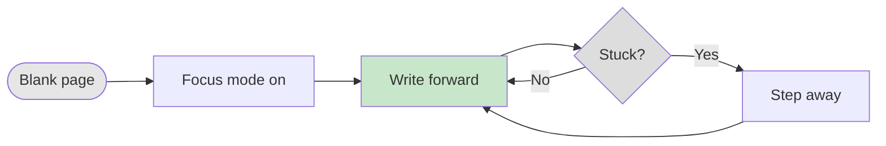
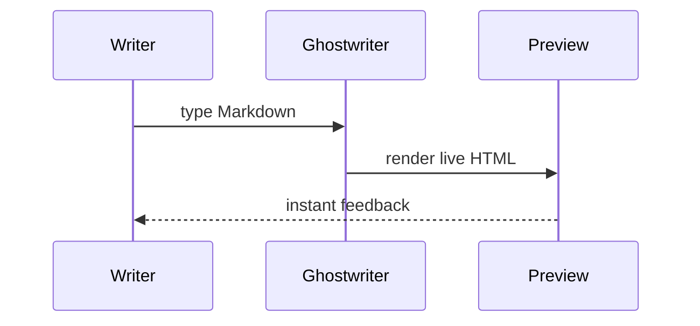

# Ghostwriter — A Distraction-Free Markdown Editor

## Contents<!-- omit in toc -->

- [Ghostwriter — A Distraction-Free Markdown Editor](#ghostwriter--a-distraction-free-markdown-editor)
  - [Frontmatter \& Cover Page](#frontmatter--cover-page)
  - [Typography](#typography)
- [Heading 1](#heading-1)
  - [Heading 2](#heading-2)
    - [Heading 3](#heading-3)
      - [Heading 4](#heading-4)
        - [Heading 5](#heading-5)
          - [Heading 6](#heading-6)
  - [Lists](#lists)
  - [Tables](#tables)
  - [Code Blocks](#code-blocks)
  - [Mermaid Diagrams](#mermaid-diagrams)
  - [Infographics](#infographics)
  - [Math — KaTeX](#math--katex)
  - [Admonitions \& Alerts](#admonitions--alerts)
    - [GitHub Alerts](#github-alerts)
    - [MkDocs Admonitions](#mkdocs-admonitions)
  - [Blockquotes, Footnotes \& Abbreviations](#blockquotes-footnotes--abbreviations)
  - [Keyboard Shortcuts](#keyboard-shortcuts)
  - [Markdown Extras](#markdown-extras)
    - [Highlight, Subscript \& Superscript](#highlight-subscript--superscript)
    - [Definition Lists](#definition-lists)
    - [Code Line Highlighting](#code-line-highlighting)
    - [Captions](#captions)
    - [Columns](#columns)
    - [Collapsible Details](#collapsible-details)
    - [Spanning Table Cells](#spanning-table-cells)
    - [Including Source Files](#including-source-files)
  - [Document Controls](#document-controls)
    - [Numbered Headings](#numbered-headings)
    - [Running Header](#running-header)
    - [List of Tables \& Figures](#list-of-tables--figures)
    - [Watermark](#watermark)
    - [Code Line Numbers](#code-line-numbers)
    - [Trademark Symbols](#trademark-symbols)
    - [Classification](#classification)
    - [Frontmatter Variables](#frontmatter-variables)
    - [TOC Depth](#toc-depth)
    - [Paper Size \& Margins](#paper-size--margins)
    - [Page Orientation](#page-orientation)
    - [Cover \& Footer Overrides](#cover--footer-overrides)
    - [Cross-References with Page Numbers](#cross-references-with-page-numbers)
    - [Landscape Pages](#landscape-pages)
  - [Icons](#icons)
    - [Font Awesome](#font-awesome)
    - [Phosphor Icons](#phosphor-icons)
  - [Page Breaks \& Layout](#page-breaks--layout)
  - [Theme \& Branding](#theme--branding)
    - [Named Styles](#named-styles)
    - [Colour Palette](#colour-palette)
    - [Brand Logo](#brand-logo)
    - [Scheme Classes](#scheme-classes)
    - [Custom Style](#custom-style)
    - [Fonts](#fonts)

---

## Frontmatter & Cover Page {.page-break-before}

[Ghostwriter](https://ghostwriter.kde.org) is a free, open-source, distraction-free Markdown editor with live preview, a focus "hemingway" mode, and clean typography. The **`ghostwriter`** theme echoes its quiet, dark-sidebar aesthetic.

```yaml
---
# ── Document identity ─────────────────────────────────────────────
Title: Ghostwriter — A Distraction-Free Markdown Editor
Document Info:                 # the cover's info block
    Author: wereturtle
    Date: "2026-04-08"
    Revision: 1
    Status: Final              # Work In Progress | Released — Released bumps the revision after export
Revisions Visible: 3           # rows shown on the cover; 0 hides the table
Revisions:
    - {Revision: 1, Date: "2026-04-08", Author: wereturtle, Remarks: Initial release}
Lang: en                       # <html lang>; default en

# ── Branding ──────────────────────────────────────────────────────
Theme: roryg-ghostwriter       # brand package — see --list-themes
Style: Ghostwriter             # a named style
# Style:                       # …or an inline style instead of a named one:
#     Color: "#336699"         #   any hex, or a palette name
#     Image: path/or/url.jpg   #   hero photo behind a translucent gradient
#     Position: 30%            #   vertical crop offset
Logo: assets/brand-logo.svg    # path to an image (this theme defines no named logos)
Cover Logo:                    # a third-party logo overlaid on the cover
    - Path: assets/customer-logo.png
    - Background: rgba(255,255,255,0.5)

# ── Page setup ────────────────────────────────────────────────────
Header:                        # blank = use Title
Footer:                        # blank = "<page> of <total>"
Page Size: A4                  # A3 | A4 | A5 | Letter | Legal | Tabloid | "210mm 297mm"
Margins: 20mm                  # 1–4 CSS lengths, like the margin shorthand
TOC Depth: 3                   # deepest heading level listed; omit for all

# ── Document controls (all default to off) ────────────────────────
Numbered Headings: true        # 1, 1.1, 1.1.1 on h2–h6
Running Header: true           # header tracks the current section
List of Tables: true
List of Figures: true
Code Line Numbers: true
Trademark Symbols: true        # (c)/(r)/(tm) -> ©/®/™; off (default) keeps them literal
Watermark: Draft               # any text, or true to reuse Status
Classification: Internal       # Public | Internal | Confidential

# ── Content & output ──────────────────────────────────────────────
Variables:                     # {{Customer}} anywhere in the body
    Customer: Acme Manufacturing
Mode: pdf, html                # pdf | html | debug — comma-separated
---
```

**Title & subtitle.** On the cover the `Title` is split at the first *spaced* em-dash (`A — B`), en-dash, or colon (`A: B`). Here **Ghostwriter** is the headline and *A Distraction-Free Markdown Editor* the subtitle. A title without a separator renders as a single headline.

**Every key is optional** and all of them are case-insensitive (`Page Size` and `page size` both work). Omit one and the export falls back to a sensible default.

**Document identity**

| Key | Description |
| --- | ----------- |
| `Title` | Split into headline + subtitle on the cover, as above |
| `Document Info` | Cover info block — `Author`, `Date`, `Revision`, `Status` |
| `Revisions` | List of `{Revision, Date, Author, Remarks}` entries for the revision table |
| `Revisions Visible` | How many revision rows the cover shows; `0` hides the table |
| `Lang` | Document language for the `<html lang>` attribute (default `en`) |

`Revision` in the footer resolves in order: `Document Info.Revision`, then the last `Revisions` entry, then a top-level `Version` or `Revision`.

**Branding**

| Key | Description |
| --- | ----------- |
| `Theme` | Brand package — `Ghostwriter` here; see `--list-themes` |
| `Style` | Cover variant: a named style (`Ghostwriter`), or `{Color, Image, Position}` |
| `Logo` | Brand mark, chosen independently of `Style` |
| `Cover Logo` | Third-party logo overlaid on the cover — `Path` plus optional `Background` |

**Page setup**

| Key | Description |
| --- | ----------- |
| `Header` | Top-left running header; blank uses the `Title` |
| `Footer` | Footer text; blank uses `<page> of <total>` |
| `Page Size` | `A3`, `A4`, `A5`, `Letter`, `Legal`, `Tabloid`, or a literal `210mm 297mm` |
| `Margins` | 1–4 CSS lengths, like the CSS `margin` shorthand |
| `TOC Depth` | Deepest heading level listed in the TOC; omit for every level |

**Document controls** — each covered in its own section further down

| Key | Description |
| --- | ----------- |
| `Numbered Headings` | Auto-number `##`–`######` as 1, 1.1, 1.1.1 |
| `Running Header` | Header tracks the current section instead of a fixed string |
| `List of Tables` | Index of captioned tables after the TOC |
| `List of Figures` | Index of captioned figures after the TOC |
| `Code Line Numbers` | Number every line of every fenced code block |
| `Trademark Symbols` | Converts `(c)`/`(r)`/`(tm)` to ©/®/™ — off by default |
| `Watermark` | Diagonal stamp; `true` reuses `Status` |
| `Classification` | `Public`, `Internal` or `Confidential` in the top-right margin |

**Content & output**

| Key | Description |
| --- | ----------- |
| `Variables` | Named values substituted into the body as `{{Name}}` |
| `Mode` | `pdf`, `html`, `debug` — comma-separated for several |

> [!TIP]
> The frontmatter at the top of this document sets every one of these, so it doubles as a working reference — read it alongside the rendered result.

---

## Typography

# Heading 1
## Heading 2
### Heading 3
#### Heading 4
##### Heading 5
###### Heading 6

Normal paragraph text. **Bold text** stands out, while *italic text* adds emphasis. You can also combine them: ***bold and italic***.

Inline `code` suits toggles like `Focus Mode` or `Hemingway Mode`.

**Plain emphasis.** The markdown syntaxes stay plain, so a document reads the same here as it does anywhere else: ~~strikethrough~~ is an ordinary struck line, and ++underline++ gives you the underline markdown otherwise lacks. Neither is tinted.

**Revision marks.** The redline tint lives on the HTML tags, which you write deliberately: `<ins>inserted</ins>` and `<del>deleted</del>`, plus `==highlighted==`. Reaching for a tag is the opt-in — plain `~~tilde~~` never implies a tracked revision.

We <ins>added this clause</ins>, <del>removed that one</del>, and ==flagged this for review==. Compare plain ~~struck text~~ and ++underlined text++, which carry no revision colour.

Links look like this: [Ghostwriter](https://ghostwriter.kde.org). They are clickable in the PDF.

Emoji are supported too 👻 — from classics like ✅ 📝 ⚠️ to recent additions: pink heart 🩷 and jellyfish 🪼.

Horizontal rules separate sections:

---

## Lists

**Focus features** (unordered):

- Live HTML preview
- Focus mode — highlight the current sentence
  - Hemingway mode — disable the delete key
  - Full-screen, chrome-free editing
- Live word-count and reading time

**A focused draft** (ordered):

1. Enter full screen
2. Turn on focus mode
   1. Dim all but the current line
   2. Keep writing forward
3. Review with live preview

**Mixed:**

- Compose
  1. no formatting toolbar
  2. just Markdown
- Preview
  1. live HTML
  2. custom CSS

---

## Tables

Even a minimalist editor renders tables. Columns can be left-, center-, or right-aligned.

| Feature        | Purpose                    | Mode     |
| -------------- | -------------------------- | -------- |
| Focus mode     | highlight current sentence | writing  |
| Hemingway mode | disable deleting           | drafting |
| Live preview   | see rendered HTML          | any      |

**Column alignment:**

| Left-aligned | Center-aligned | Right-aligned |
| :----------- | :------------: | ------------: |
| focus        |    forward     |           500 |
| preview      |      live      |            12 |
| export       |     clean      |             3 |

---

## Code Blocks {.page-break-before}

Fenced code blocks use `highlight.js` for syntax highlighting.

**A custom preview stylesheet:**

```css
.markdown-body {
  max-width: 42rem;
  color: #d0d0d0;
  background: #1b1b1b;
  font-family: "Open Sans", Arial, sans-serif;
}
```

**Front-matter Ghostwriter passes through:**

```yaml
---
title: Night Notes
tags: [journal, draft]
---
```

**Export via pandoc:**

```sh
pandoc notes.md -o notes.pdf
```

---

## Mermaid Diagrams {.page-break-before}

Mermaid diagrams are rendered to SVG and embedded directly in the PDF.

**The focus loop:**



**Draft to document:**



---

## Infographics {.page-break-before}

` ```infographic ` fences render [AntV Infographic](https://github.com/antvis/infographic)'s declarative syntax — lists, sequences, hierarchies, comparisons and charts — with no browser. Icons are [Iconify](https://icon-sets.iconify.design/) names, and only those names are sent. Many templates give text a fixed slot, so keep labels short.

**From blank page to document:**

```infographic
infographic sequence-ascending-steps
data
  lists
    - label Blank page
    - label Focus mode
    - label Write forward
    - label Document
```

---

## Math — KaTeX {.page-break-before}

Expressions are rendered by KaTeX — inline and as display blocks.

Ghostwriter estimates reading time from word count $w$ at $r$ words per minute (inline): $t = w / r$.

**Display block — reading time in minutes:**

$$
t = \frac{w}{r}, \qquad r \approx 200\ \text{wpm}
$$

For a $1{,}600$-word essay:

$$
t = \frac{1600}{200} = 8\ \text{minutes}
$$

---

## Admonitions & Alerts {.page-break-before}

Two syntaxes are supported: **GitHub Alerts** and **MkDocs-style admonitions**.

### GitHub Alerts

> [!NOTE]
> Ghostwriter is free and open source, part of the KDE community.

> [!TIP]
> Hemingway mode disables the delete key so you draft forward and edit later.

> [!IMPORTANT]
> Everything is plain Markdown — your notes stay readable without the app.

> [!WARNING]
> Live preview re-renders on every keystroke; very large files may lag.

> [!CAUTION]
> Focus mode hides autosave indicators — make sure autosave is enabled.

### MkDocs Admonitions

!!! note
    Default note admonition — no custom title.

!!! tip Themes
    Ghostwriter ships light and dark themes and accepts custom CSS for preview.

!!! abstract Ethos
    Remove the interface; keep the words.

!!! success
    Draft saved. Reading time updated.

---

## Blockquotes, Footnotes & Abbreviations

**Blockquote:**

> The first draft of anything is just you telling yourself the story.
>
> — attributed to Ernest Hemingway

**Footnotes:**

Ghostwriter is built with Qt.[^qt] It supports multiple Markdown processors.[^proc]

[^qt]: A cross-platform C++ toolkit, part of KDE.
[^proc]: cmark, Sundown, and others, selectable in settings.

**Abbreviations:**

*[MD]: Markdown
*[HTML]: HyperText Markup Language
*[KDE]: K Desktop Environment

For example: Ghostwriter renders MD to HTML live, and ships with the KDE community's open-source tooling.

---

## Keyboard Shortcuts

Use the `<kbd>` tag to render a keyboard key or chorded shortcut:

```markdown
<kbd>Ctrl</kbd> + <kbd>Alt</kbd> + <kbd>Space</kbd>
```

Press <kbd>Ctrl</kbd> + <kbd>Alt</kbd> + <kbd>Space</kbd> to open the launcher. Single keys work the same way: <kbd>Esc</kbd>, <kbd>Enter</kbd>, <kbd>⌘</kbd>, <kbd>⇧</kbd>.

---

## Markdown Extras {.page-break-before}

### Highlight, Subscript & Superscript

Mark important text with `==highlight==`: this phrase is ==highlighted== for emphasis.

Chemical formulas use subscript (`H~2~O`): water is H~2~O and carbon dioxide is CO~2~.

Exponents use superscript (`x^2^`): the area of a circle is πr^2^, and 2^10^ = 1024.

### Definition Lists

```markdown
Term
: Definition of the term, indented below it.
```

Markdown
: A lightweight markup language for formatting plain text.

WeasyPrint
: The HTML-to-PDF rendering engine used for the PDF output mode.

### Code Line Highlighting

Add a `:2,4-6`-style line range after the language to highlight specific lines — no space, no braces (braces there would collide with `markdown-it-attrs`' own `{.class}` syntax on fences):

````markdown
```typescript:2,4-5
function greet(name: string): string {
    const greeting = `Hello, ${name}!`;
    console.log(greeting);
    return greeting;
    // highlighted through here
}
```
````

```typescript:2,4-5
function greet(name: string): string {
    const greeting = `Hello, ${name}!`;
    console.log(greeting);
    return greeting;
    // highlighted through here
}
```

### Captions

Add a `Table: caption` or `Figure: caption` paragraph directly under a table or image for an auto-numbered caption. Tables and figures are numbered independently:

| A   | B   |
| --- | --- |
| 1   | 2   |

Table: Two-column example with an auto-numbered caption.

Figures work the same way — the counters are independent, so this is Figure 1 even though Table 1 came first:


Figure: A standalone image with an auto-numbered caption.

### Columns

Lay content out side by side with nested containers. The outer wrapper needs **more** colons than the inner blocks (`::::` outside, `:::` inside) — with equal-length fences the parser can't tell which `:::` closes which block:

```markdown
:::: columns
::: column
Left column content.
:::
::: column
Right column content.
:::
::::
```

:::: columns
::: column
**Left column.** Good for a summary, a quote, or a short list.
:::
::: column
**Right column.** Good for the counterpart — a comparison, a caveat, or supporting detail.
:::
::::

### Collapsible Details

`<details>` / `<summary>` renders as a styled block. In the **PDF** it always shows its content — there's no click to expand on paper. In the **HTML export**, opened in a real browser, it's genuinely collapsible.

<details>
<summary>Click to expand (in HTML — always open in PDF)</summary>

Hidden detail content goes here. Useful for optional context that shouldn't compete with the main flow.

</details>

---

### Spanning Table Cells

Merge cells with `{colspan=N}` / `{rowspan=N}` on the cell. The rule is the same in both directions: **the covered cells are simply not written**, so a spanning row has fewer `|` cells than the header.

```markdown
| Region         | Site      | Role    |
| -------------- | --------- | ------- |
| EU {rowspan=2} | Venlo     | Primary |
| Genk           | Secondary |
```

| Region         | Site      | Role    |
| -------------- | --------- | ------- |
| EU {rowspan=2} | Venlo     | Primary |
| Genk           | Secondary |
| APAC           | Osaka     | Primary |

Table: `{rowspan=2}` — the covered row writes one fewer cell.

| Phase                               | Task         | Owner |
| ----------------------------------- | ------------ | ----- |
| Design                              | Draft schema | WB    |
| Spans first two columns {colspan=2} | PS           |

Table: `{colspan=2}` — that row writes one fewer cell too.

### Including Source Files

`[!include](file.md)` splices another markdown document. Two extensions to it:

- **Any non-markdown file** is quoted as a fenced code block, with the language inferred from its extension — so documentation can quote live source instead of a copy that silently rots.
- **A `#L` fragment** takes only those lines: `#L10` for one line, `#L10-L25` for a range. Works on markdown includes too, where it splices the excerpt inline (no page break, no revision heading) rather than as a whole document.

```markdown
[!include](../src/types.ts)           <!-- whole file, as TypeScript -->
[!include](../src/types.ts#L3-L9)     <!-- just those lines -->
[!include](chapter.md#L1-L20)         <!-- a markdown excerpt, spliced inline -->
[!include](Main.config "xml")         <!-- override the language -->
```

A **link title overrides the language**, for extensions that say nothing about their content — a `.config` file is usually XML, not a language called "config". It combines with a range (`Main.config#L5-L40 "xml"`), and because a language only means anything for a code block, giving one also *forces* code-block treatment: `[!include](chapter.md "markdown")` quotes the markdown source instead of splicing it in.

Lines 3–9 of this project's `src/types.ts`, pulled in live at export time:

[!include](../../src/types.ts#L3-L9)

---

## Document Controls {.page-break-before}

These are switched on per document from the YAML frontmatter — **this sample enables all of them**, so every effect described below is visible in this very PDF:

```yaml
Numbered Headings: true      # 1, 1.1, 1.1.1 on every heading
Running Header: true         # top-left header tracks the current section
List of Tables: true         # index of captioned tables, after the TOC
List of Figures: true        # index of captioned figures, after the TOC
Code Line Numbers: true      # number every line of every code block
Trademark Symbols: true      # (c)/(r)/(tm) -> ©/®/™
Watermark: Sample            # diagonal stamp; `true` reuses Document Info → Status
Classification: Internal     # Public | Internal | Confidential
```

### Numbered Headings

`Numbered Headings: true` prefixes every `##`–`######` with a hierarchical number: `##` is section 1, `###` is 1.1, `####` is 1.1.1. `#` is never numbered — it is the document title, not a section.

The numbering is applied before the table of contents is rebuilt, so **the TOC always shows the same numbers as the body** — they cannot drift apart.

### Running Header

`Running Header: true` replaces the static `Header:` string in the top-left margin with the title of the section currently being read. Flip back to this page's header and you will see it reads *Document Controls*, not the document title.

### List of Tables & Figures

`List of Tables: true` and `List of Figures: true` each emit an index directly after the table of contents, built from the auto-numbered captions described under [Captions](#captions){.page-ref} — with live page numbers, like the TOC. An enabled list with no captions of that kind emits nothing rather than an empty heading.

### Watermark

`Watermark: Sample` stamps a faint diagonal label across every page — the word you are reading behind this text. Setting `Watermark: true` instead reuses the document's `Status` field, which is the usual way to mark a *Work in Progress* draft.

### Code Line Numbers

`Code Line Numbers: true` numbers every line of every fenced code block, which pairs naturally with the line highlighting from [Code Line Highlighting](#code-line-highlighting){.page-ref} — you can then write "see line 4" and have it mean something:

```typescript:3
interface ExportOptions {
    theme: string;
    mode: ("pdf" | "html")[];   // line 3 — highlighted and numbered
}
```

### Trademark Symbols

`Trademark Symbols: true` converts `(c)`, `(r)`, `(tm)` to ©, ®, ™. It defaults to **off**, because those sequences show up far more often as literal parentheticals — a revision marker written `(R)`, an option labelled `(c)` — than as an actual trademark reference, and silently swapping one for a symbol would corrupt real text. This document opts in, so here they convert: (c) (r) (tm).

### Classification

`Classification:` prints a sensitivity label in the **top-right** margin of every page:

| Value          | Result                                      |
| -------------- | ------------------------------------------- |
| `Public`       | a green shield followed by *Public*         |
| `Internal`     | an amber shield followed by *Internal*      |
| `Confidential` | an orange shield followed by *Confidential* |

Table: The three Classification values and what each prints.

This document is set to `Internal`, so an amber shield sits in the top-right corner of every page. The shield is Phosphor's duotone weight: the fill takes the classification colour, the outline is black.

### Frontmatter Variables

Define a `Variables:` mapping and reference it as `{{Name}}` anywhere in the body — the substitution happens before parsing, so a value can be a word, a URL, or a whole sentence. One template, many customers:

```yaml
Variables:
    Customer: Acme Manufacturing
    Contact: J. de Vries
```

> This document was prepared for **{{Customer}}**, contact {{Contact}}.

An undefined placeholder is left exactly as written and logged as a warning — blanking it silently would let a typo ship as an invisible hole in a customer deliverable.

### TOC Depth

`TOC Depth: 3` limits the table of contents to `###` and shallower. Deeper headings still render — and still get numbered — they just stop cluttering the contents page. This document uses depth 3, which is why the `####` heading under [Typography](#typography){.page-ref} is absent from the TOC but present in the body.

### Paper Size & Margins

```yaml
Page Size: A4        # A3 | A4 | A5 | Letter | Legal | Tabloid, or "210mm 297mm"
Margins: 20mm        # 1–4 CSS lengths, like the CSS margin shorthand
```

`Margins` accepts the same 1–4 value shorthand as CSS (`20mm`, `25mm 15mm`, `25mm 15mm 20mm 15mm`). Both also drive the height cap applied to diagrams, so a tall Mermaid chart is scaled to fit the sheet it lands on instead of running off the bottom — which matters most on a `::: landscape` page, where a rotated A4 is only 210mm tall.

### Page Orientation

`Orientation: landscape` turns the **whole** document landscape — body pages and cover alike. It defaults to `portrait`, which is what this sample uses.

```yaml
Orientation: landscape
```

Either way, two containers force a single sheet of the opposite orientation, so the document default is only ever a default:

```markdown
::: landscape        <!-- one landscape sheet, in a portrait document -->
| a wide table … |
:::

::: portrait         <!-- one portrait sheet, in a landscape document -->
Ordinary prose that reads better upright.
:::
```

They are symmetric — `::: portrait` is simply the mirror of the `::: landscape` shown under [Landscape Pages](#landscape-pages){.page-ref}, and each is a harmless no-op when it matches the document default.

### Cover & Footer Overrides

The generated cover and the page-margin logo can be tuned per document, without editing the theme. Every one of these keys also accepts `false` to remove that element outright:

```yaml
Cover Page: false                    # no cover at all — but Style's colours stay
Cover Slogan: Engineering, delivered.
Cover Address:                       # a list becomes one line per entry
    - Acme Manufacturing B.V.
    - Industrieweg 12
Cover Footer Logo: Cherry            # a name from the theme's logos map, or a path
Footer Logo: Cherry                  # the same mark, bottom-centre of every page
```

| Key | Controls | `false` |
| --- | -------- | ------- |
| `Cover Page` | whether a cover is generated at all | no cover page |
| `Cover Slogan` | the slogan line, bottom-left of the cover | line removed |
| `Cover Address` | the address block, right of the cover's info table | block removed |
| `Cover Footer Logo` | the brand mark, bottom-right of the cover | mark removed |
| `Footer Logo` | the brand mark in the bottom-centre page margin | mark removed |

Table: The cover and footer override keys.

`Cover Page: false` is worth calling out: omitting `Style` also removes the cover, but takes the brand colours with it — headings and table headers fall back to the theme default. This key removes only the page.

Logo values resolve the same way as [Brand Logo](#brand-logo){.page-ref} — a name from the theme's `logos` map, or a path — so a typo exits with code 3 instead of quietly reverting to the house mark.

### Cross-References with Page Numbers

Add `{.page-ref}` to any internal link and the resolved page number is appended when the PDF is laid out:

```markdown
See [the Captions section](#captions){.page-ref} for details.
```

See [the Captions section](#captions){.page-ref} for details — the page number in that sentence was computed at export time, not typed.

### Landscape Pages

Wrap wide content in a `::: landscape` container to give it its own rotated sheet, instead of squeezing it into the portrait text column:

```markdown
::: landscape
| a wide table … |
:::
```

The table below sits on its own landscape page:

::: landscape

| WBS     | Task                        | Form | Hours | Role            | Location | Milestone |
| ------- | --------------------------- | ---- | ----- | --------------- | -------- | :-------: |
| 1.1.1.1 | Review requirements         | TM   | 2     | Consultant      |          |           |
| 1.1.2.1 | Project brief               | NA   | 0     | Account Manager | Customer |     Y     |
| 1.2.1.1 | Project management          | TM   | 4     | Project Manager |          |           |
| 1.2.3.1 | Scoping workshop @ customer | FP   | 8     | PM, Consultant  | Customer |     Y     |

Table: A seven-column table given its own landscape sheet.

:::

---

## Icons {.page-break-before}

Two icon libraries are bundled automatically when their tags appear.

### Font Awesome

| Style    | HTML                                                       | Result                                                       |
| -------- | ---------------------------------------------------------- | ------------------------------------------------------------ |
| Solid    | `<i class="fa-solid fa-ghost">`                            | <i class="fa-solid fa-ghost"></i>                            |
| Solid    | `<i class="fa-solid fa-feather">`                          | <i class="fa-solid fa-feather"></i>                          |
| Coloured | `<i class="fa-solid fa-circle-check" style="color:#222;">` | <i class="fa-solid fa-circle-check" style="color:#222;"></i> |

### Phosphor Icons

<i class="ph ph-pen-nib"></i> regular &nbsp; <i class="ph-bold ph-moon"></i> bold &nbsp; <i class="ph-fill ph-check-circle" style="color:#222;"></i> fill

---

## Page Breaks & Layout

Add `{.page-break-before}` after a heading to start it on a new page:

```markdown
## My Section {.page-break-before}
```

The attribute is stripped from the TOC link and anchor. Use `<!-- omit in toc -->` after a heading to keep it out of the Table of Contents.

---

## Theme & Branding {.page-break-before}

A **theme** is a swappable brand package under `themes/`. The **`ghostwriter`** theme reflects the editor's quiet, focused aesthetic on the shared base layout.

```yaml
Theme: roryg-ghostwriter
Style: Ghostwriter
```

### Named Styles

The `roryg-ghostwriter` theme ships a single style whose **main** colour drives the cover accents and tints headings and table headers:

| Style name    | Primary colour |
| ------------- | -------------- |
| `Ghostwriter` | `#222222`      |

### Colour Palette

The **Ghostwriter** ramp — `extraLight` → `light` → `main` → `dark` → `extraDark`:

**Ghostwriter** — `#f2f2f2` · `#7a7a7a` · `#222222` · `#181818` · `#0e0e0e`

Each palette is also emitted into the document as CSS variables named `--<palette>-<stop>` (lowercase), so custom CSS can reference the theme's colours instead of restating hex values:

```css
var(--ghostwriter-main)
var(--ghostwriter-extra-light)
var(--ghostwriter-dark)
```

Every palette additionally gets a gradient token, `--gradient-<palette>` (135°, `light` → `dark`):

```css
background: var(--gradient-ghostwriter);
```

These are generated from `theme.json`, which is the single source of truth for the theme's colour — a theme's CSS never redeclares a palette value.

### Brand Logo

`Logo:` overrides the brand mark shown on the cover and in the page header, **independently of `Style:`**:

```yaml
Style: Ghostwriter
Logo: assets/customer-logo.svg
```

The value is a path to an image, or — for themes that define a `logos` map in `theme.json` (the `modern` theme does, one per fruit palette) — one of those names. Paths resolve against the theme directory first, then the working directory. An unrecognised value is a hard error rather than a silent fallback to the house logo. Omit the key to keep the theme's own logo.

> [!NOTE]
> `Logo` and `Cover Logo` are different: `Logo` is the *theme's* brand mark, while `Cover Logo` overlays a *third-party* logo (a customer or partner) on the cover.

### Scheme Classes

Every palette gets a pair of utility classes for inline colour blocks — `<theme>-<palette>-scheme` (heavy) and `<theme>-<palette>-light-scheme` (content-first):

```html
<div class="roryg-ghostwriter-ghostwriter-scheme">Ghostwriter — heavy scheme</div>
<div class="roryg-ghostwriter-ghostwriter-light-scheme">Ghostwriter — light scheme</div>
```

<div class="roryg-ghostwriter-ghostwriter-scheme">Ghostwriter — heavy scheme</div>
<div class="roryg-ghostwriter-ghostwriter-light-scheme">Ghostwriter — light scheme</div>

Available in this theme: `roryg-ghostwriter-ghostwriter-scheme` (each with a `-light-scheme` variant).

The text colour is chosen automatically: white where it clears the WCAG AA contrast threshold against the background, and the palette's darkest stop where it doesn't — so a pale `main` can't produce unreadable white-on-light text.

### Custom Style

Instead of the named style, provide a `Color` and an optional hero `Image`:

```yaml
Style:
    Color: "#222222"
    Image: https://example.com/hero.jpg
```

### Fonts

The **Ghostwriter** theme sets its typography to a clean, readable sans-serif suited to long writing sessions:

`"Open Sans", Arial, sans-serif`
